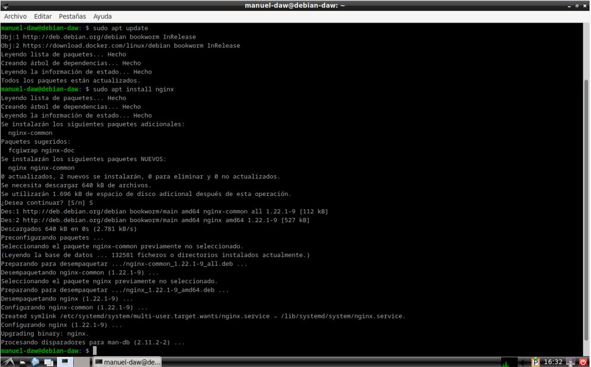
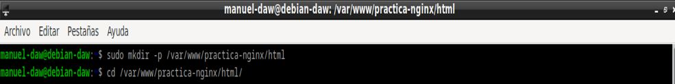
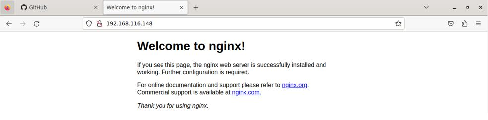
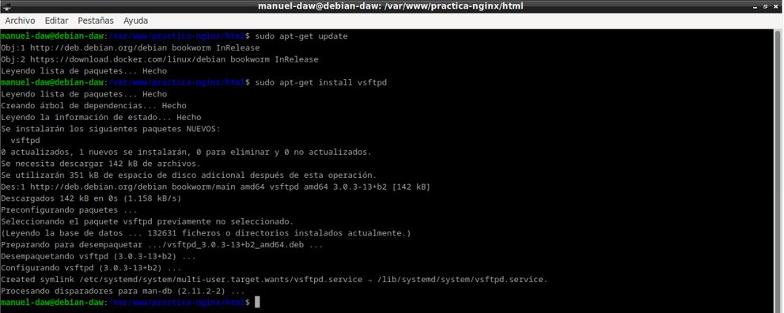

# Autor: Manuel Gómez Ruiz
# Asignatura: Despliegue de Aplicaciones Web
# Fecha: 10/10/2024
# Curso: 2º de Desarrollo de Aplicaciones Web

## Práctica 2.1 - Instalación y configuración de un servidor web Nginx

## El objetivo de la práctica es instalar y configurar un servidor web en un SO Debian, de tal forma que permita conexiones por HTTPS y FTP.

### Instalación servidor web Nginx

Lo primera sería actualizar los repositorios e instalar el paquetes correspondiente que contienen el servidor Nginx, para ello usaremos el comando **sudo apt update && sudo apt install nginx**

Esto descargará e instalará Nginx desde los repositorios oficiales de tu distribución.

Una vez instalado, es crucial comprobar que Nginx se haya instalado correctamente y que el servicio esté activo, para ello utilizaremos el comando **sudo systemctl status nginx** para verificar el estado.

Ahora, crearemos las carpetas necesarias para el sitio web que alojará Nginx. Para ello utilizaremos el comando **mkdir -p** para crear múltiples carpetas de manera recursiva, y en esas carpetas se almacenarán los archivos de tu sitio web.

Ahora clonamos el repositorio de GitHub que contendrá una plantilla para nuestro servidor, para ello utiliza el comando **git clone** junto a la url del repositorio de CloudAcademy **https://github.com/cloudacademy/sample-web-app.git**, debes clonarlo en /var/www/tu_sitio_web/html

Necesitamos asegurarnos de que el servidor Nginx tenga los permisos adecuados para acceder y servir los archivos, utiliza los comandos **chown** y otorga los permisos correctos al usuario y grupo **www-data** (usuario predeterminado de Nginx)

Verificamos el funcionamiento del servidor, para ello introduce el comando **ip a** y copia tu IP, después introduce en el navegador **http://tu_ip**

### Configuración de servidor web NGINX

Editamos el archivo de configuración del sitio web para personalizar la configuración de Nginx, utiliza el comando **nano /etc/nginx/sites-available/tu-sitio-web**

Hacemos el enlace simbólico con el comando **ln -s** para hacer que Nginx lo reconozca como un sitio activo, lo agregue en la carpeta sites-enabled y esté disponible en el servidor.

En nuestra máquina anfitriona, entra en la ruta **C:\Windows\System32\drivers\etc\hosts** con permisos de administrador y añade en la última línea la IP de tu Debian y el nombre de tu página web, esto hará que podamos acceder al sitio web de nuestra máquina virtual desde nuestro anfitrión.

Comprobamos que las peticiones se estén registrando en los archivos de registro (logs) de Nginx.

### FTP

Para configurar un servidor FTP en Debian y así permitir la transferencia de archivos, debemos de instalar **vsftpd**, que es un servidor FPT ligero y seguro.

Creamos carpeta en el Home llamada FTP, que será a la que se accederán los clientes a través del puerto 21, para la subida o descarga de archivos.

Modificación del fichero /etc/vsftpd.conf, para permitir el acceso a usuarios locales, añadir SSL y certificado.

Reiniciamos el servicio **vsftpd** para que los cambios hagan efecto.

Instalamos FileZilla en nuestro anfitrión y realizamos una conexión FTP al servidor a través del puerto 21, para ello necesitamos la IP del servidor, su nombre de usuario y contraseña.

Nos dará información sobre el certificado de seguridad.

Acceso realizado con éxito.

Ahora vamos a intentar realizar una conexión a través del puerto 22.

Y pasamos un fichero .ZIP a través de FTP.

Comprobamos que ha llegado correctamente al servidor.

### HTTPS

Para habilitar la seguridad en tu sitio web, es importante configurar HTTPS, que garantiza que la información entre el cliente y el servidor esté cifrada. Para ello, necesitaremos crear un certificado SSL.

Instalamos openssl, herramienta fundamental para generar certificados SSL.

Generamos el certificado utilizando OpenSSL.

Configuramos Nginx para que utilice HTTPS. Para ello, edita el archivo de configuración usando **sudo nano /etc/nginx/sites-available/tu-sitio-web**, y añade las rutas al certificad, la clave privada y asegurate que Nginx escuche en el puerto 443.

Comprobamos con el comando **nginx -t** que la sintaxis y la configuración son válidas.

Modificamos de nuevo nuestro fichero host, con las direcciones añadidas anteriormente a server_name.

Probamos a conectarnos a través de HTTP en nuestra máquina anfitriona.

Nos conectamos a través de HTTPS.

