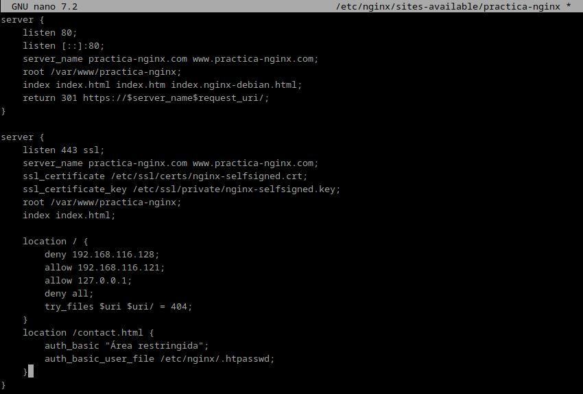
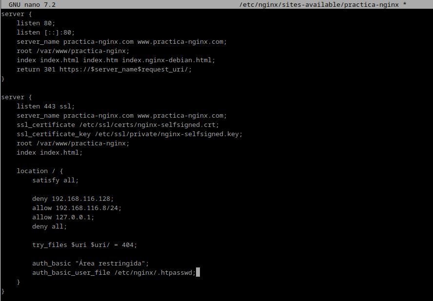
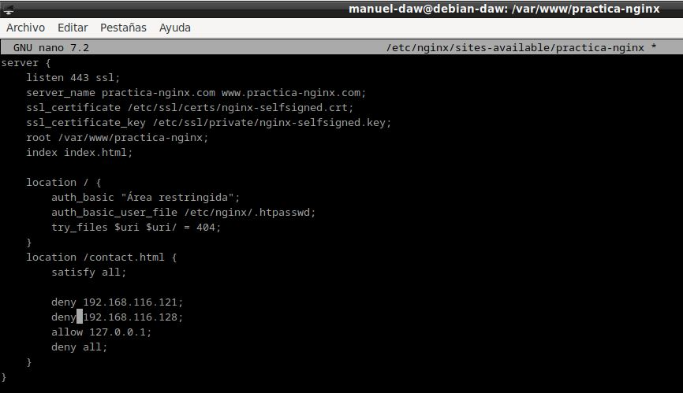
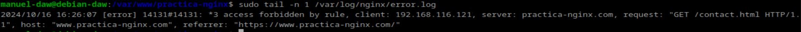
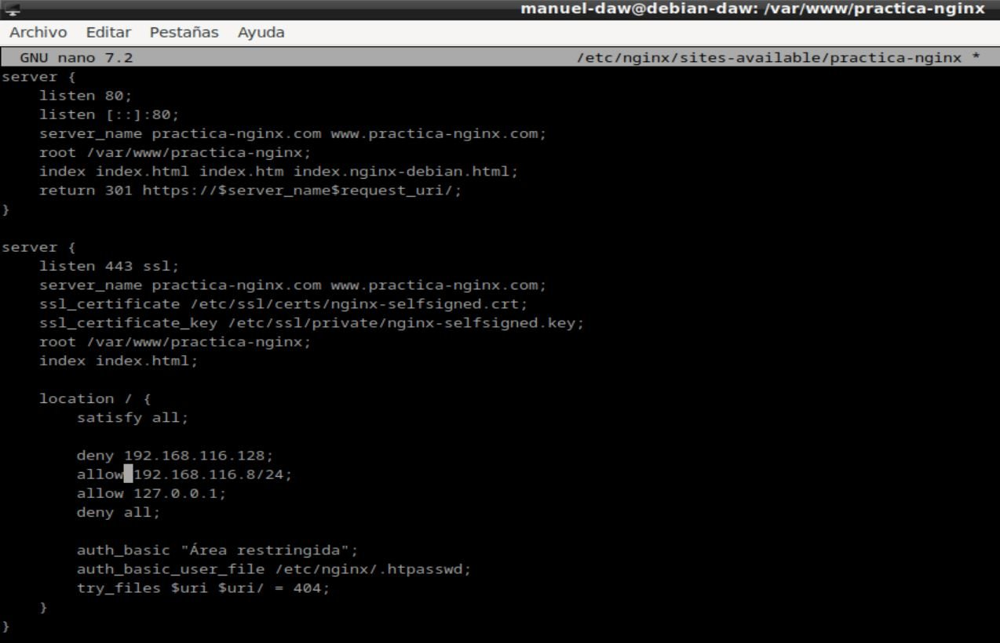

***Autor: Manuel Gómez Ruiz***

***Asignatura: Despliegue de Aplicaciones Web***

***Fecha: 15/10/2024***

***Curso: 2º de Desarrollo de Aplicaciones Web***

## Práctica 2.2 - Autenticación en un servidor Nginx.

***Paquetes necesarios para realizar la práctica.***

Utiliza el comando **dpkg -l | grep openssl**, en caso de que el resultado no sea el mismo, instala el paquete **openssl**, con el comando **sudo apt install openssl**

El comando **dpkg -l** lista todos los paquetes instalados en el sistema con información detalla, mientras que **grep openssl** busca el nombre del paquete openssl dentro de nuestro sistema.

### 1. Creación de usuarios y contraseñas para el acceso web

A continuación, vamos a crear los usuarios de nuestra página web con sus respetivas contraseñas, las cuales se guardarán encriptada en un fichero llamado **.htpasswd**

Utiliza el comando **sudo sh -c "echo -n 'usuario-web:' >> /etc/nginx/.htpasswd**, el cual creara el fichero **.htpasswd** y le agregará el nombre del usuario. 

Haz lo mismo con las contraseñas, para ello usa el comando **sudo sh -c "openssl passwd -apr1 >> /etc/nginx/.htpasswd"**, este comando será el encargado de guardar las contraseñas encriptadas, gracias al **openssl passwd -apr1**.

- Crea dos usuarios, uno con tu nombre y otro con tu primero apellido.

Debes de realizar el mismo proceso que antes, pero ahora crea un usuario con tu propio nombre, comando  **sudo sh -c "echo -n 'tu-nombre:' >> /etc/nginx/.htpasswd** para añadir al usuario y **sudo sh -c "openssl passwd -apr1 >> /etc/nginx/.htpasswd"** para la contraseña.

Usuario con mi apellido.

- Comprueba que el usuario y la contraseña aparecen cifrados en el fichero:

Para ello debemos revisar el archivo donde se almacenan las contraseña de nuestro servidor, en mi caso voy a utilizar un comando que visualiza lo que hay dentro del archivo sin necesidad de abrirlo, comando **sudo cat /etc/nginx/.htpasswd**

### 2. Configurando el servidor Nginx para usar una autentificación básica

Añadimos la autenticación en el fichero **/etc/nginx/sites-availables/nombre-web**

Reiniciamos el servidor y comprobamos que no haya ningún error.

### 3. Probando la nueva configuración

Comprobación 1: Comprueba desde tu máquina física/anfritiona que puedes acceder a https://nombre-sitio-web y que se solicita la autenticación.

Comprobación 2: Comprueba que si decides cancelar la autenticación, se te negará el acceso al sitio con un error. ¿Qué error es?

**Error 401: Authorization required**

### Tareas

Tarea 1

- Intenta entrar primero con un usuario erróneo y luego con otro correcto. Puedes ver todos los sucesos y registros en los logs access.log y error.log

- Adjunta una captura de pantalla de los logs donde se vea que intentas entrar primero con un usuario inválido y con otro válido. Indica dónde podemos ver los errores de usuario inválido o no encontrado, así como donde podemos ver el número de error que os aparecía antes

Archivo log error.log

Archivo log access.log

Tarea 2

- Borra las dos líneas que hacen referencia a la autenticación básica en el location del directorio raíz. Tras ello, añade un nuevo location debajo con la autenticación básica para el archivo/sección contact.html únicamente.

Modificamos el archivo de configuración.

Después de esto, reiniciamos el servidor Nginx para aplicar los cambios.

Probamos los cambios en nuestro equipo anfitrión, accediendo a contact.html.

### Combinación de la autenticación básica con la restricción de acceso por IP.

La autenticación básica HTTP puede ser combinada de forma efectiva con la restricción de acceso por dirección IP. Se pueden implementar dos escenario:

- Un usuario debe estar ambas cosas, autenticado y tener una IP válida

- Un usuario debe o bien estar autenticado, o bien tener una IP válida

Veamos cómo lo haríamos:

1. Como permitir o denegar acceso sobre una IP concreta (directivas allow y deny, respectivamente). Dentro del block server o archivo de configuración del dominio web, que recordad está en el directorio sites-available:

Haz un restart para guardar los cambios.

2. Combinar la restricción IP y la autenticación HTTP con la directiva satisfy.

### Tareas (2)

Tarea 1 - Configura Nginx para que no deje acceder con la IP de la máquina anfitriona al directorio raíz de una de tus dos webs. Modifica su server block o archivo de configuración. Comprueba como se deniega el acceso:

- Muestra la página de error en el navegador.

- Muestra el mensaje de error de error.log

Tarea 2 - Configura Nginx para que desde tu máquina anfitriona se tenga que tener tanto una IP válida como un usuario válido, ambas cosas a la vez, y comprueba que sí puede acceder sin problemas.

