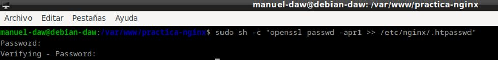
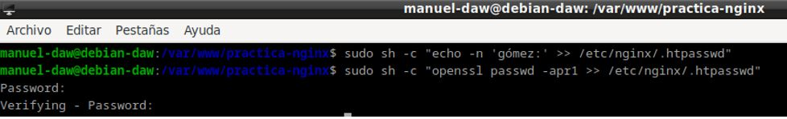
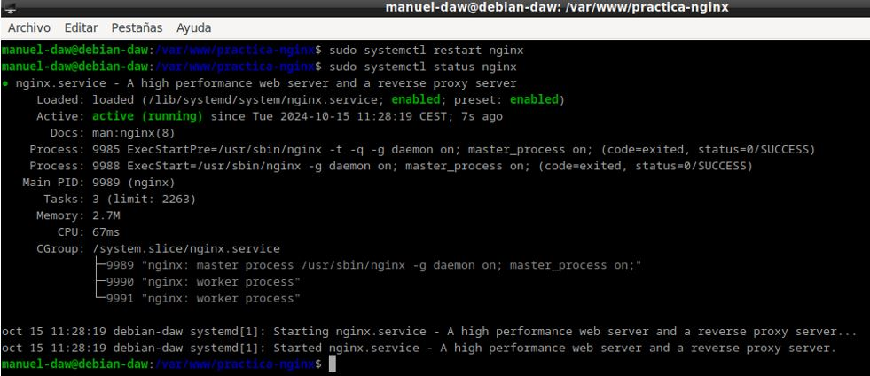
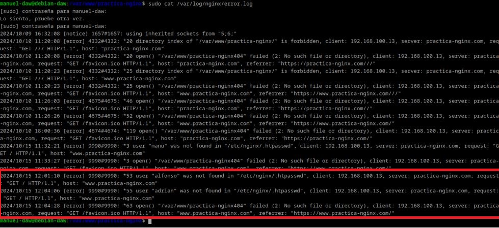

***Autor: Manuel Gómez Ruiz***

***Asignatura: Despliegue de Aplicaciones Web***

***Fecha: 15/10/2024***

***Curso: 2º de Desarrollo de Aplicaciones Web***

## Práctica 2.2 - Autenticación en un servidor Nginx.

### Objetivo de la práctica: Aprender a configurar el acceso a páginas web.

***Paquetes necesarios para realizar la práctica.***

Utiliza el comando **dpkg -l | grep openssl**, en caso de que el resultado no muestre el paquete **openssl**, instalalo con el comando **sudo apt install openssl**

El comando **dpkg -l** lista todos los paquetes instalados en el sistema con información detallada, mientras que **grep openssl** busca el nombre del paquete openssl dentro de nuestro sistema.

### 1. Creación de usuarios y contraseñas para el acceso web

A continuación, vamos a crear los usuarios de nuestra página web con sus respetivas contraseñas, las cuales se guardarán encriptada en un fichero llamado **.htpasswd**

Utiliza el comando **sudo sh -c "echo -n 'usuario-web:' >> /etc/nginx/.htpasswd**, el cual creara el fichero **.htpasswd** y le agregará el nombre del usuario.

Haz lo mismo con las contraseñas, para ello usa el comando **sudo sh -c "openssl passwd -apr1 >> /etc/nginx/.htpasswd"**, este comando será el encargado de guardar las contraseñas encriptadas, gracias al **openssl passwd -apr1**.

- Crea dos usuarios, uno con tu nombre y otro con tu primero apellido.

Debes de realizar el mismo proceso que antes, pero ahora crea un usuario con tu propio nombre, comando  **sudo sh -c "echo -n 'tu-nombre:' >> /etc/nginx/.htpasswd** para añadir al usuario y **sudo sh -c "openssl passwd -apr1 >> /etc/nginx/.htpasswd"** para la contraseña.

Usuario con mi apellido.

- Comprueba que el usuario y la contraseña aparecen cifrados en el fichero:

Para ello debemos revisar el archivo donde se almacenan las contraseña de nuestro servidor, en mi caso voy a utilizar un comando que visualiza lo que hay dentro del archivo sin necesidad de abrirlo con un editor, comando **sudo cat /etc/nginx/.htpasswd**

### 2. Configurando el servidor Nginx para usar una autentificación básica

Añadimos la autenticación en el fichero **/etc/nginx/sites-availables/nombre-web**, para ello utilizamos la directiva **auth_basic** que solicita la autenticación a los usuarios que intentar acceder a un recurso protegido y enlazamos el fichero **.htpasswd** con los usuarios y contraseñas a la directiva **auth_basic_user_file** 

Reiniciamos el servidor con el comando **sudo systemctl restart nginx** para así aplicar los cambios del archivo de configuración **/etc/nginx/sites-available/nombre-web** y comprobamos que no haya ningún error con un **sudo systemctl status nginx**

### 3. Probando la nueva configuración

**Comprobación 1**: Comprueba desde tu máquina física/anfritiona que puedes acceder a https://nombre-sitio-web y que se solicita la autenticación.

Entra en la página web e introduce un usuario incorrecto.

El resultado será que te volverán a pedir las credenciales de acceso.

Ahora metemos un usuario y contraseña correcto, es decir, que están dentro del fichero **.htpasswd** 

Como ves nos deja acceder a la página web.

**Comprobación 2**: Comprueba que si decides cancelar la autenticación, se te negará el acceso al sitio con un error. ¿Qué error es?

**Error 401: Authorization required**, es un código de estado HTTP que indica que la solicitud realizada por el cliente no tiene las credenciales de autenticación necesarias para acceder al recurso solicitado.

### Tareas

**Tarea 1**

- Intenta entrar primero con un usuario erróneo y luego con otro correcto. Puedes ver todos los sucesos y registros en los logs access.log y error.log

- Adjunta una captura de pantalla de los logs donde se vea que intentas entrar primero con un usuario inválido y con otro válido. Indica dónde podemos ver los errores de usuario inválido o no encontrado, así como donde podemos ver el número de error que os aparecía antes

Archivo log error.log, para verlo he utilizado el comando **sudo cat /var/log/nginx/access.log**, y he marcado con rojo los últimos errores generados por usuarios incorrectos, aunque sería más correcto utilizar **sudo tail -n 3 /var/log/access.log**, esto proporcionaría solo los 3 últimos errores generados en **error.log** haciendo la salida por pantalla mucho más limpia.

Archivo log access.log, comando **sudo tail -n 5 /var/log/nginx/access.log**

**Tarea 2**

- Borra las dos líneas que hacen referencia a la autenticación básica en el location del directorio raíz. Tras ello, añade un nuevo location debajo con la autenticación básica para el archivo/sección contact.html únicamente.

Lo primero de todo es crear el archivo **contact.html**, para ello voy a copiar el **index.html** para crear el nuevo archivo **contact.html** y voy a cambiar un poco el fichero, comandos: **sudo cp ./index.html contact.html** y **sudo nano contact.html**.

Modificamos el archivo de configuración, quitando la autenticación en la raíz del servidor, y añadiendosela a **contact.html**.

Después de esto, reiniciamos el servidor Nginx para aplicar los cambios, **sudo systemctl restart nginx**.

Probamos los cambios en nuestro equipo anfitrión, accediendo a **contact.html**, como se puede apreciar, debido a los cambios en el archivo de configuración, al entrar nos pide la autenticación.

### Combinación de la autenticación básica con la restricción de acceso por IP.

La autenticación básica HTTP puede ser combinada de forma efectiva con la restricción de acceso por dirección IP. Se pueden implementar dos escenario:

- Un usuario debe estar ambas cosas, autenticado y tener una IP válida

- Un usuario debe o bien estar autenticado, o bien tener una IP válida

Veamos cómo lo haríamos:

1. Como permitir o denegar acceso sobre una IP concreta (directivas allow y deny, respectivamente). Dentro del block server o archivo de configuración del dominio web, que recordad está en el directorio **sites-available**:

En este primer caso, voy a permitir el acceso a la página web al cliente con la IP 192.168.116.121, pero el acceso estará rechazado para todos los demás, tanto en **index.html** como en **contact.html**

Haz un restart para guardar los cambios.

2. Combinar la restricción IP y la autenticación HTTP con la directiva satisfy.

En este caso, la directiva **satisfy** nos permite definir si queremos el acceso para todo tipo de usuarios, si debe tener una IP válida o usuario válido o si ambas cosas deben ser válidas para acceder, podemos combinarlo con las directivas **deny** y **allow** para tener más control.

### Tareas (2)

**Tarea 1** - Configura Nginx para que no deje acceder con la IP de la máquina anfitriona al directorio raíz de una de tus dos webs. Modifica su server block o archivo de configuración. Comprueba como se deniega el acceso:

Accede al archivo de configuración **/etc/nginx/sites-available/sitio-web**

- Muestra la página de error en el navegador.

**Error 403 Forbidden**, este código de estado HTTP indica que el servidor ha entendido la solicitud del cliente, pero se niega a autorizarla, es decir, el cliente está autenticado pero no tiene permisos para acceder.

- Muestra el mensaje de error de error.log, comando: **sudo tail -n 1 /var/log/nginx/error.log**

**Tarea 2** - Configura Nginx para que desde tu máquina anfitriona se tenga que tener tanto una IP válida como un usuario válido, ambas cosas a la vez, y comprueba que sí puede acceder sin problemas.

Modificamos de nuevo el archivo de configuración **/etc/nginx/sites-available/sitio-web**, esta vez con la directiva **satisfy all** que hace que tengamos que tener tanto IP como autenticación correcta, para acceder a la página web, así que añade tu IP dentro de **location** usando la directiva **allow**

Reinicia el servidor y haz una prueba de acceso.

Resultado con usuario y contraseña correcta.

