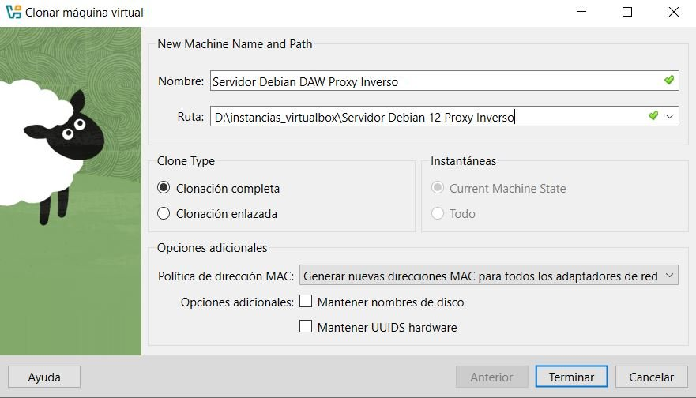
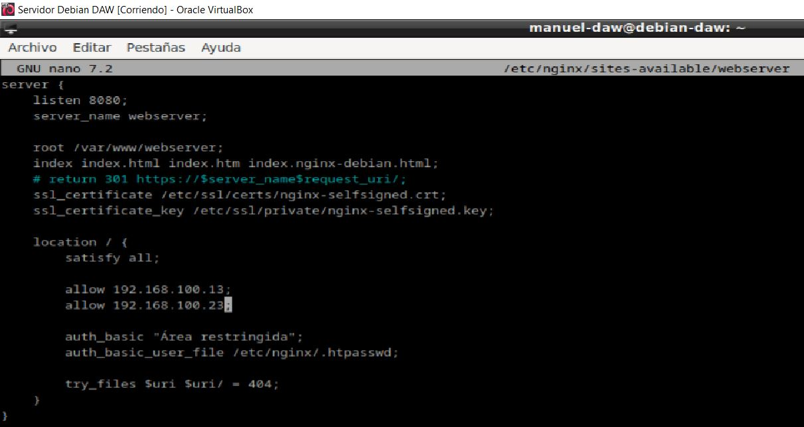
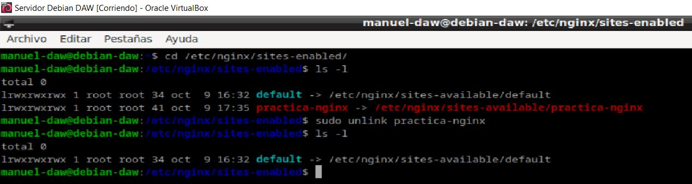
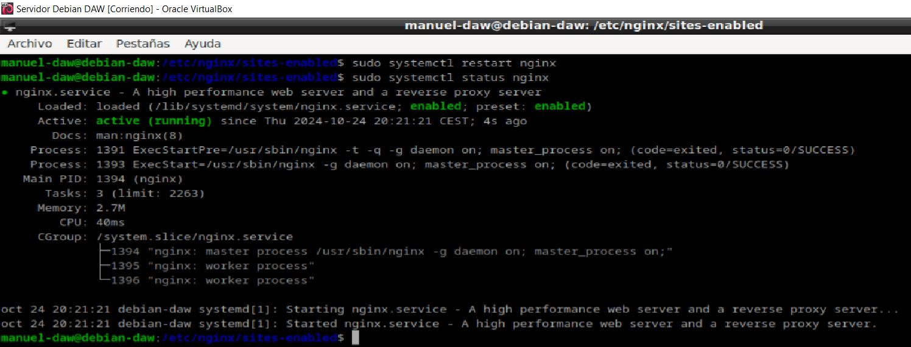
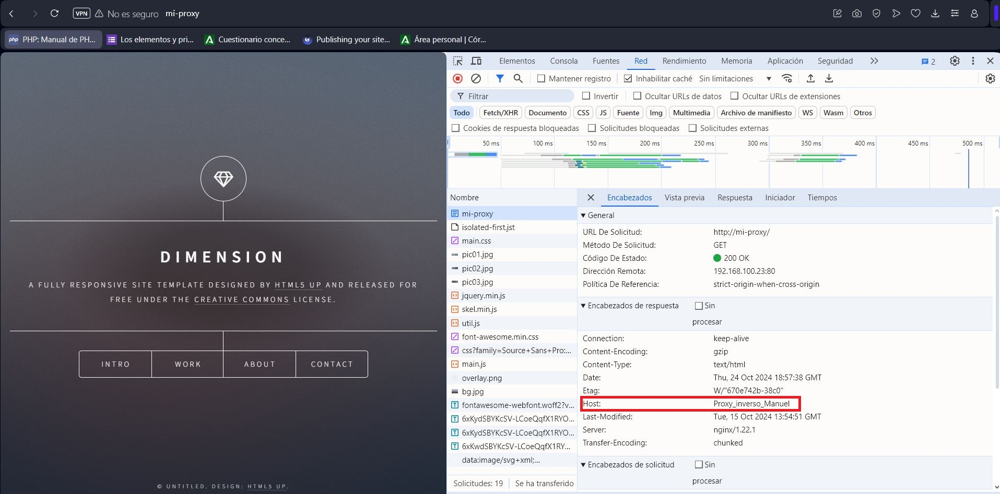

***Autor: Manuel Gómez Ruiz***

***Asignatura: Despliegue de Aplicaciones Web***

***Fecha: 17/10/2024***

***Curso: 2º de Desarrollo de Aplicaciones Web***

## Práctica 2.3 - Proxy Inverso con Nginx

## Objetivo de la práctica: Configurar un proxy inverso, que permitirá proteger a nuestro servidor de los clientes, evitando posibles ataques DDoS al servidor. De esta manera, la IP del servidor quedará oculta mientras que accederemos a los proxys, que se encargarán de redireccionar y balancear el tráfico entre varios servidores.

### Configuraciones

### Servidor Web

Primero, vamos a clonar la máquina virtual que contiene nuestro servidor Nginx,
para crear un nuevo servidor que funcionará como proxy inverso.

Para ello, haz click derecho sobre tu servidor Debian y selecciona Clonar, introduce el nombre
de la nueva máquina virtual, elige la carpeta donde se guardará y cambia la política
de dirección MAC seleccionando la opción Generar nuevas direcciones MAC para todos los adaptadores de red.

Esto es importante para asegurar que el proxy y el servidor tengan IPs distintas, lo cual es necesario para la configuración.

Cambia el nombre que tuviera el archivo de configuración de nuestro servidor Nginx por el de **webserver**, el cual es una convención para facilitar la administración, usa el comando: **sudo mv /etc/nginx/sites-available/nombre-servidor /etc/nginx/sites-available/webserver**

Cambiar el nombre del sitio web dentro de este archivo de configuración, para ello usa el comando  **sudo nano /etc/nginx/sites-available/nombre-servidor**, y modifica el nombre en la directiva **server_name**, 

Ahora vamos a eliminar el link simbólico antiguo con el comando **unlink nombre_del_link** dentro de la carpeta **sites-enabled** y crear el nuevo para el nuevo nombre de archivo.

Eliminamos el anterior navegando hasta **sites_enabled** y usando el comando **unlink**, después comprueba que no aparezca con **ls -l**

Creamos el nuevo enlace simbólico.

En el archivo de configuración del sitio web, en lugar de hacer que el servidor escuche en el puerto 80, cambiadlo al 8080, para acceder a el vuelve a introducir el comando **sudo nano /etc/nginx/sites-available/webserver**.

Esto lo haremos para que todo quede más diferenciado y os quede más claro que la petición está pasando por el proxy inverso y llega al servidor web destino.

Reinicia Nginx para aplicar los cambios y comprueba el estado del servicio, **sudo systemctl restart nginx** y **sudo systemctl status nginx**.

### Nginx Proxy Inverso

Borramos el archivo de configuración y el enlace simbólico que fue clonado desde nuevo servidor, y lo sustituimos 
por un nuevo archivo de configuración que hará que este nuevo servidor actue como proxy, comando **sudo nano ejemplo-proxy**

Hacemos el enlace simbólico para que este archivo de configuración se active, y que así cuando hagamos el reinicio del servidor funcione.

Reiniciamos el servicio Nginx para surtir los cambios.

Añadimos al cliente la IP del proxy **ejemplo-proxy** junto a su **server_name**, accediendo a la ruta **C:\Windows\System32\drivers\etc\hosts**, con esto ya deberíamos poder acceder a la página web mediante el proxy.

Comprobamos que podemos acceder desde el cliente al servidor backend a través del proxy. Esto significa que el tráfico web esta siendo correctamente dirigido desde el cliente al proxy, y el proxy está reenviando las solicitudes al servidor backend.

### Comprobaciones

Verifica que todo funciona correctamente, usando las herramientas de análisis HTTP para inspeccionar las cabeceras de las solicitudes y respuesta.

Para ello pulsa **Control+Shift+C** y dirigete a la pestaña **Red**, sino te aparece nada refresca la página con **F5**, después selecciona el elemento con el nombre de tu servidor y comprueba que la solicitud devuelva 200 OK como código de estado.

### Añadiendo cabecera

Añadiendo nueva cabecera HTTP personalizada que contiene mi nombre. Esto es útil, por ejemplo, para agregar información adicional en las solicitudes que llegan al backend o simplemente para personalizar la respuesta del servidor.

Reiniciamos el servidor y al recargar la página con el cliente deberíamos de visualizar la nueva cabecera.

