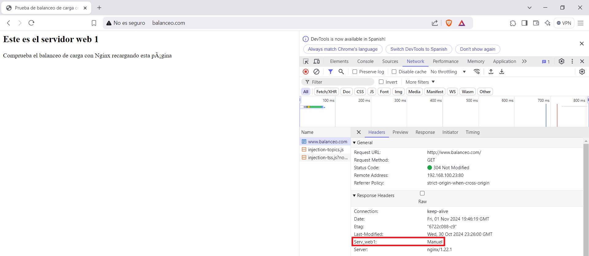

***Autor: Manuel Gómez Ruiz***

***Asignatura: Despliegue de Aplicaciones Web***

***Fecha: 25/10/2024***

***Curso: 2º de Desarrollo de Aplicaciones Web***

## Práctica 2.4 - Balanceo de carga con proxy inverso en Nginx

### Objetivo de la práctica: Configurar Nginx como proxy inverso y balanceador de carga para distribuir el tráfico web entre varios servidores, mejorando eficiencia, disponibilidad y resiliencia del sitio. El tráfico se redirigirá aleatoriamente entre los servidores, y en caso de fallo de uno, las peticiones se enviarán automáticamente al otro.

### Configuración del servidor principal

### Importante: Crea un nuevo servidor que sea una clonación del servidor principal, con la opción activada para que tengan diferentes IPS.

Primero, debes desvincular el enlace simbólico para que la plantilla de Nginx que habíamos configurado deje de visualizarse, para ello dirigete a la ruta **/etc/nginx/sites-enabled** con el comando **cd /etc/nginx/sites-enabled** y utiliza el comando **unlink** junto al nombre del archivo de configuración de tu servidor.

Usa **ls -l** para verificar que el archivo esté desvinculado.

Cambia el nombre de la carpeta que está dentro de **/var/www/** para configurar el sitio web específico.

Accede a **/var/www/webserver/html** y crea el fichero **index.html**, con el comando **sudo nano /var/www/webserver/html/index.html**, después añade el contenido que desees, en mi caso voy a usar un HTML muy básico que muestre el mensaje **Este es el servidor web 1** para indicar que estamos accediendo al servidor principal.

Renombra la configuración en **/etc/nginx/sites-available**

Edita el archivo de configuración que acabamos de cambiar el nombre (**/etc/nginx/sites-available/webserver**), y especifica la ruta del directorio en la directiva **root**, para que muestre el nuevo **index.html**. También, cambia el nombre en la directiva **web_server** y añade las IPs que podrán acceder al servidor, los cuales van a ser el cliente, el servidor proxy y la máquina clonada.

Creamos el nuevo enlace simbólico, utilizando el comando **ln -s /etc/nginx/sites-available/webserver /etc/nginx/sites-enabled**, y luego confirma que esté activo con **ls -l**. Ahora, el **index.html** del servidor principal debería mostrarse.

Reiniciamos para guardar cambios con **sudo systemctl restart nginx**, después verificamos la sintaxis en los archivos de configuración con **sudo nginx -t** y revisamos el estado de Nginx con **sudo systemctl status nginx**.

### Configuración del servidor clonado

Repite el proceso anterior para configurar el servidor clonado, el cual recibirá peticiones junto con el servidor principal.

Desvincular el enlace simbólico para que la plantilla de Nginx que habíamos configurado deje de visualizarse, para ello dirigete a la ruta **/etc/nginx/sites-enabled** con el comando **cd /etc/nginx/sites-enabled** y utiliza el comando **unlink** junto al nombre del archivo de configuración de tu servidor.

Comprueba que haya funcionado con un **ls -l**

Cambia el nombre de la carpeta en **/etc/nginx/sites-available** y usa **ln -s** para crear un nuevo **enlace simbólico**, comprobando después que este activo.

Cambia el nombre de la carpeta que está dentro de **/var/www/**

Accede a **/var/www/webserver/html** y crea un fichero **index.html**, con el comando **sudo nano /var/www/webserver/html/index.html**, después añade el contenido, en mi caso he añadido otro HTML básico que ponga el mensaje **Servidor Web 2**, que indicará cuándo se redirige al servidor clonado.

Modificamos archivo de configuración **/etc/nginx/sites-available/webserver**, estableciendo la ruta al nuevo **index.html**, cambiando el nombre en la directiva **web_server**, añadiendo un encabezado HTTP y añadiendo las IPs que podrán acceder a este servidor.

Reiniciamos para guardar cambios, con el comando **sudo systemctl restart nginx**, después realizamos las comprobaciones de sintaxis **sudo nginx -t** y ejecución **sudo systemctl status nginx** para revisar el estado de Nginx y determinar que todo esté correcto.

### Configuración del Proxy Inverso para balanceo de carga

Configuramos un nuevo archivo de configuración  al cual llamaré **balanceo**, este script permitirá que las peticiones se distribuyan de forma aleatoria entre los dos servidores.

Deshacemos el enlace simbólico anterior del proxy inverso, que ahora será reemplazado por el archivo **balanceo** que permitirá tanto balanceo de carga como proxy inverso.

Hacemos el enlace simbólico, que vincula el archivo **balanceo** a **sites_enabled**.

Comprobamos sintaxis del archivo de configuración, reiniciamos Nginx y después mostramos su estado, para verificar que la configuración sea correcta y esté activa.

Edita el archivo de configuración **C:\\Windows\system32\drivers\hosts** para permitir el acceso al dominio configurado como proxy (**www.balanceo.com**), el cual distribuirá las peticiones, así como a las direcciones IP de los servidores backend a los cuales el proxy redirigirá las solicitudes.

Resultado al entrar en ***www.backend_hosts.com**

### Comprobaciones Servidor 1

Ahora es el momento de comprobar el resultado, accede al **server_name** de tu servidor proxy desde el navegador del cliente, y este deberá de reenviarte a uno de los dos servidores de forma aleatoria, en mi caso mi **server_name** es ***www.balance.com**.

### Comprobaciones Servidor 2

Tras recargar una o varias veces nos aparecerá nuestro otro servidor.

### Comprobación del balanceo de carga cuando cae un servidor

Paramos el servidor 2, es decir, el clon  con el comando **sudo systemctl stop nginx** y comprobamos que todas las peticiones ahora pasan por el servidor principal.

Ahora vamos a hacer lo mismo, pero con el servidor principal, paralo e inicia de nuevo el servidor clonado con el comando **sudo systemctl start nginx**

Al parar el servicio Nginx que controla nuestro servidor web, las peticiones dejarán de poder pasar por ese servidor y serán todas reenviadas al servidor que funciona correctamente.

### Cuestiones finales

### Cuestión 1

*Busca información de qué otros métodos de balanceo se pueden aplicar con Nginx y describe al menos 3 de ellos.*

NGINX ofrece varios métodos de balanceo de carga:

- Round Robin: Este método, es sencillo y el más usado, se encarga de enviar aleatoriamente a distintos servidores las peticiones de los clientes, es ideal cuando los servidores tienen recursos muy parecidos.

- Conexiones mínimas: Método dinámico que dirige las nuevas peticiones al servidor con menos conexiones, es útil cuando los servidores tienen distintas capacidades, ayudando a evitar la sobrecarga de peticiones.

- Hash de IP: La dirección IP del cliente se usa como clave para determinar el servidor que debe gestionar la petición del cliente, asegurando que todas las peticiones de un cliente específico se envién siempre al mismo servidor. Este método es ideal para aplicaciones de redes sociales, ya que facilita conexiones persistentes, mejorando la consistencia de la experiencia del usuario.

### Cuestión 2

*Si quiero añadir 2 servidores web más al balanceo de carga, describe detalladamente qué configuración habría que añadir y dónde.*

Solo debes añadir los dos servidores al archivo de configuración de nuestro servidor proxy, en este caso el archivo de configuración de **balanceo**. Para esto, abre el archivo de configuración de Nginx correspondiente y localiza el bloque **upstream** que define el grupo de servidores backend. Agrega las direcciones IP de los dos nuevos servidores dentro de este bloque, guarda los cambios y reinicia el servicio de Nginx para aplicar la nueva configuración.

Después, asegúrate de que el sistema cliente puede resolver los nombres de los nuevos servidores agregando sus direcciones IP y nombres en el archivo **hosts** del cliente. En Windows, el archivo **hosts** se encuentra en **C:\Windows\System32\drivers\etc\hosts**.
Al final de este archivo, añade una línea para cada nuevo servidor con el formato IP dirección servidor_nombre.

Esto permitirá que el cliente pueda acceder correctamente a los nuevos servidores.

### Cuestión 3

*Describe todos los pasos que deberíamos seguir y configurar para realizar el balanceo de carga con una de las webs de prácticas anteriores.*
*Indicad la configuración de todas las máquinas (webservers, proxy...) y de sus servicios*

En los servidores web, se debe modificar la directiva **server_name**.

En el servidor proxy, se creará un nuevo archivo de configuración donde se definirá un bloque **upstream** que incluya las direcciones IP de cada servidor web. Esto permitirá que el balanceador de carga conozca qué servidores están disponibles para manejar las solicitudes.

Además, se añadirá la directiva **proxy_pass** dentro del bloque **server** para redirigir las solicitudes hacia el grupo de servidor definidos en el bloque **upstream**.