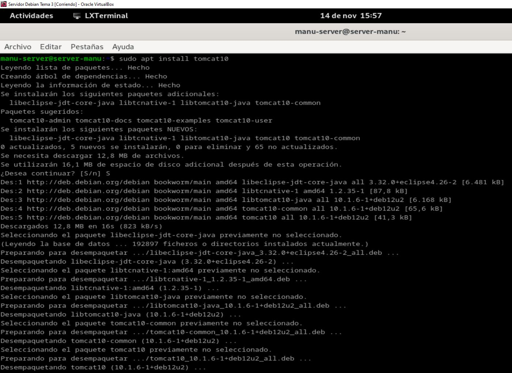
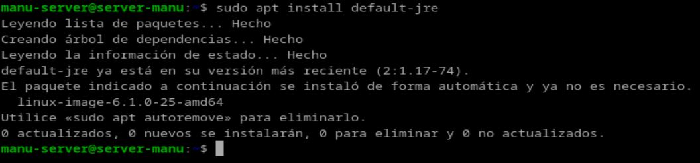
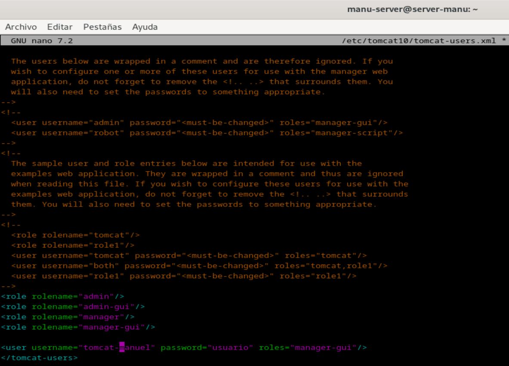
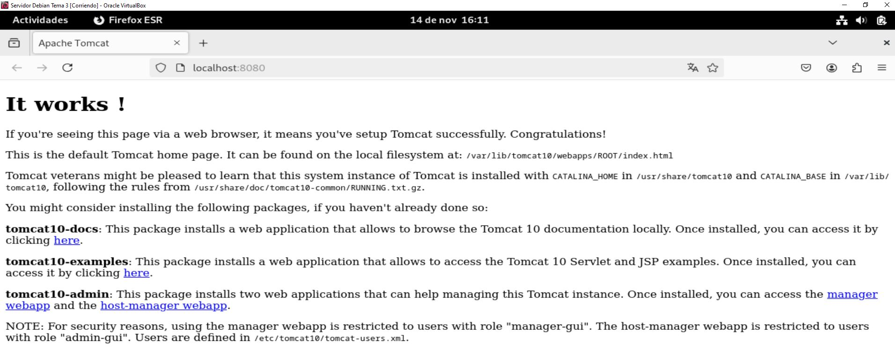
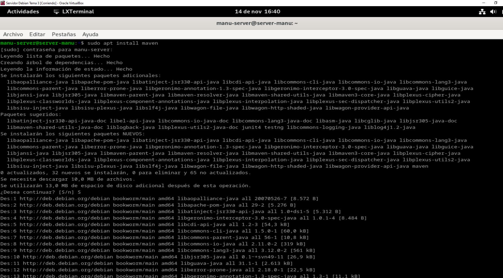
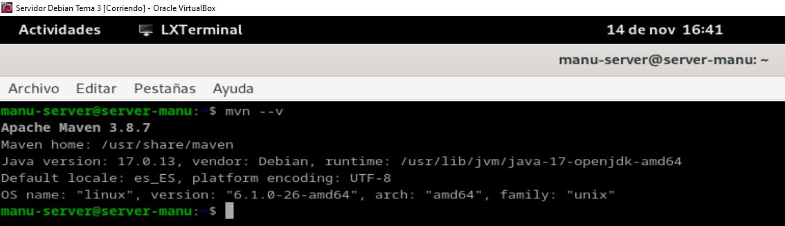
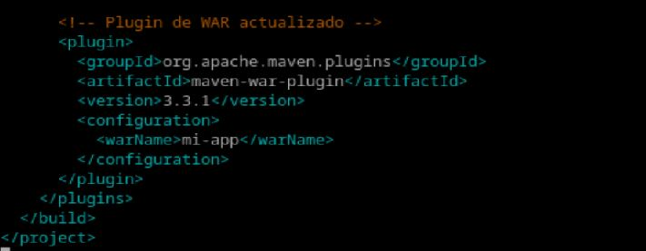

***Autor: Manuel Gómez Ruiz***

***Asignatura: Despliegue de Aplicaciones Web***

***Fecha: 17/11/2024***

***Curso: 2º de Desarrollo de Aplicaciones Web***

## Práctica 3.1 - Instalación de Tomcat

### Instalación y configuración de Tomcat

Antes de empezar, usa el comando **sudo ufw allow 8080** que permite el tráfico a través del puerto 8080, el cual es el puerto predeterminado en el que Apache Tomcat escucha las solicitudes HTTP, después usa **sudo ufw enable** para habilitar el firewall **ufw** y configurarlo para que se inicie automáticamente al arrancar el sistema, por último, instala el paquete **openjdk-17-jdk**, que contiene el kit de Desarrollo de Java, necesario para ejecutar aplicaciones Java.

Instala el paquete que contiene Tomcat, con el comando **sudo apt install tomcat10**.

Ahora crea un nuevo grupo para Tomcat que puede ser usado para gestionar permisos de acceso y ejecutar el servicio de manera segura, y crea un nuevo usuario que no puede iniciar sesión, que pertenecerá al grupo creado anteriomente añadiendole como directorio de inicio **/etc/tomcat10** y especificando que el usuario no puede iniciar sesión.

Ya puedes poner el marcha el servidor Tomcat.

Accede al fichero **tomcat-users.xml** perteneciente a la ruta **/etc/tomcat10/** y añade al nuevo usuario con los roles que aparecen en la imagen para otorgarle permisos administrativos y de gestión en Tomcat.

### Acceso a Tomcat

Comprobamos que podemos acceder a Tomcat, introduciendo en el navegador **localhost:8080**.

Para poder acceder a la aplicación web de administración de Tomcat, necesitamos descargar el paquete **tomcat-admin**.

Comprobamos que ahora podemos acceder a la interfaz administrativa introduciendo en el navegador **localhost:8080/manager/html**.

Accedamos a la aplicación web de administración de host virtuales, introduciendo en el navegador **localhost:8080/host-manager/html**.

### Despliegue

Subimos el archivo **sample.war** en **localhost:8080/manager/html** y pulsamos el botón **Desplegar**, el contenido de sample.war será descomprimido y sus contenidos se copiarán en un nuevo directorio bajo **webapps** de Tomcat, ejecutando también el archivo **web.xml** para inicializar y configurar la aplicación web según las especificaciones de **sample.war**.

Resultado

### Despliegue con Maven

Ejecuta el comando **sudo apt install maven** para instalar el paquete maven, utilizado como herramienta de gestión y comprensión de proyectos Java, para gestionar dependencias.

Muestra que Maven ha sido instalado correctamente con el comando **mvn --v**.

Creamos un nuevo usuario en el archivo de configuración **tomcat-user.xml** que será utilizado para scripts de administración.

Entra al fichero **settings.xml** dentro de **/etc/maven** y define un perfil de autenticación para Maven, que será utilizado cuando Maven quiera conectarse a servidores remotos.

Creamos un proyecto com POM.

Modificamos el POM.

### Tareas

Instala y configura GitHub, ya que lo vas a necesitar para clonar un repositorio.

Clonamos el repositorio.

### Cuestiones

**Habéis visto que los archivos de configuración que hemos tocado contienen contraseñas en texto plano, por lo que cualquiera con acceso a ellos obtendría las credenciales de nuestras herramientas.**

**En principio esto representa un gran riesgo de seguridad, ¿sabrías razonar o averigüar por qué esto está diseñado de esta forma?**

Debido a la facilidad de uso y configuración que el texto plano aporta, y su alta compatibilidad con sistemas.