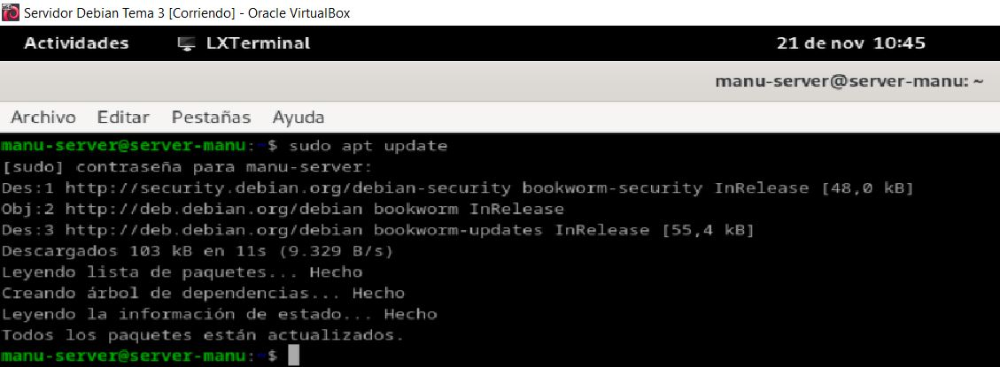
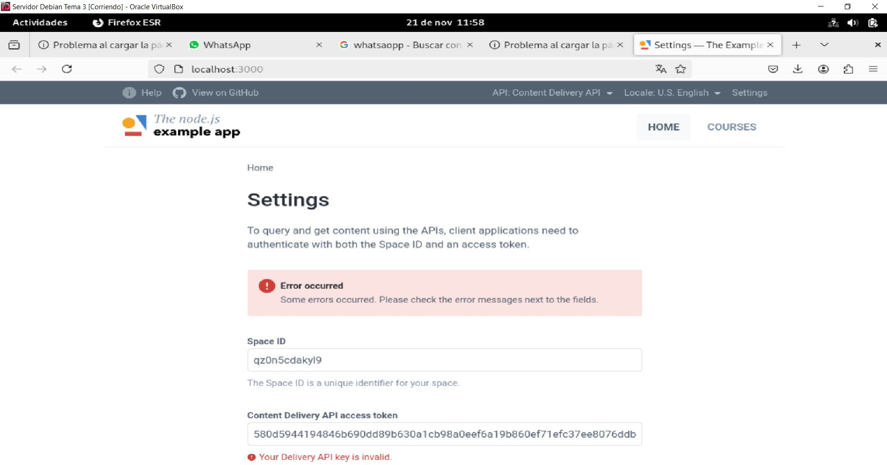
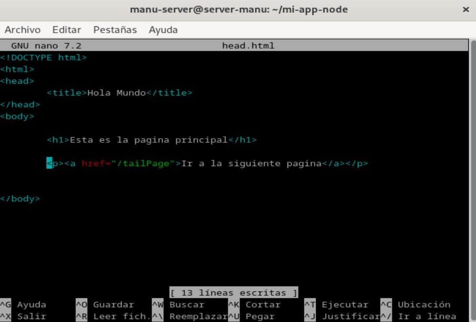
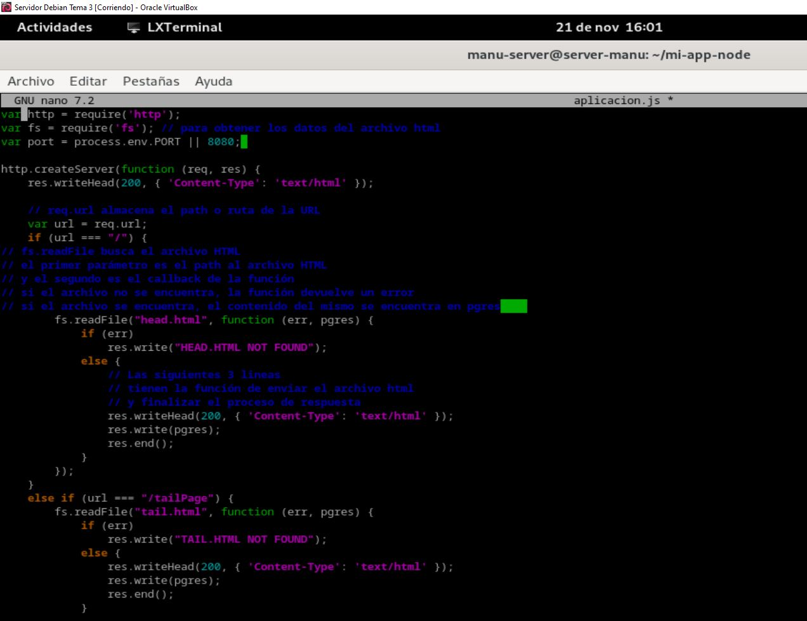
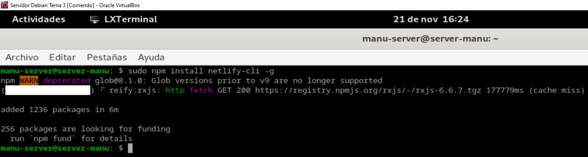
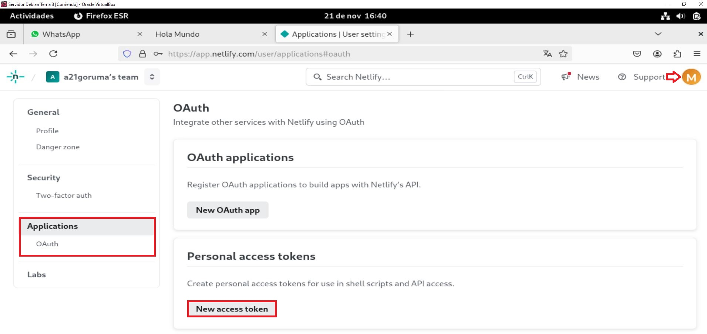
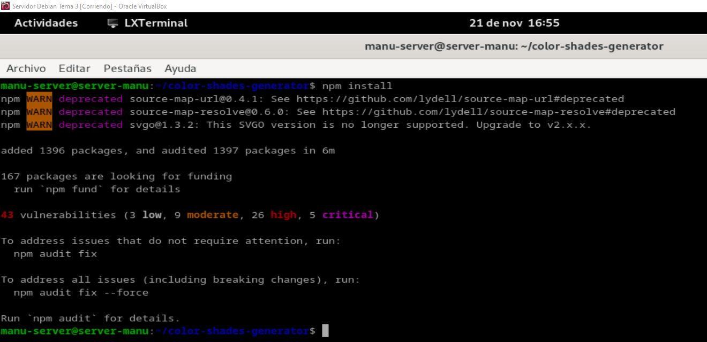

**Autor: Manuel Gómez Ruiz**

**Asignatura: Despliegue de Aplicaciones Web**

**Fecha: 21/11/2024**

**Curso: 2º de Desarrollo de Aplicaciones Web**

## Práctica 3.2: Despliegue de aplicaciones con Node Express

Detén el servicio de Tomcat para evitar problemas, con el comando **sudo systemctl stop tomcat10.service**.

Actualizamos los repositorios de la máquina virtual, con el comando **sudo apt update**.

Instalamos los repositorios **nodejs** y **npm** para poder después instalar y utilizar el plugin **express.js**, para ello usa el comando **sudo apt -y install nodejs npm**.

Comprobación de que se han instalado correctamente.

Usando **npm** instalamos el plugin **express**, comando **sudo npm install -g express**.

Crea un nuevo repositorio, accede a él e inicializalo usando npm.

Vuelve a instalar express, comando **npm install express**.

Accede al archivo **app.js** que se habrá creado al inicializar el repositorio y añade el contenido que aparece en la imagen.

Despliega el proyecto con el comando **node app.js** y visualiza los resultados.

Clona el siguiente repositorio.

Instala npm.

Despliega la página web con el comando **npm run start:dev**.

Package.json

Crea un nuevo directorio con tres archivos.

El primer archivo será llamado **head.html** y tendrá el siguiente contenido:

El segundo **tail.html**.

El script será llamado **aplicacion.js**.

Inicializamos el proyecto, con el comando **npm init**.

Corremos el programa con el comando **node aplicacion.js**.

Comprobación de resultados.

Sustituye la línea dentro de script añadiendo la línea de **start node aplicacion.js** para evitar problemas.

Clonamos el repositorio **color-shades-generator**.

Instalamos el plugin **netlify-cli**.

Iniciamos sesión en Netlify.

Creamos clave de acceso por OAuth.

Copiamos y guardamos el token devuelto.

Exportamos el token.

Volvemos a iniciar sesión.

Instalamos npm, comando **npm install**.

Comando **npm run build**.

Desplegamos el proyecto usando netlify con el comando **netlify deploy**.

Accede a la URL del final.

Resultado.

Desplegamos de nuevo, pero esta vez usando **netlify deploy --prod**.

Resultado.

Borramos nuestro sitio de Netlify.

Eliminamos nuestro directorio personal **color-shades-generator**.

Clonar nuevo proyecto con **wget**.

Crea un nuevo repositorio y descomprime lo descargado anteriormente con **wget**.

Crea un nuevo repositorio en GitHub.

Inicializa el repositorio personal descargado.

Sube los cambios.

Importa el repositorio desde Netlify.

Una vez importado cambia su nombre.

