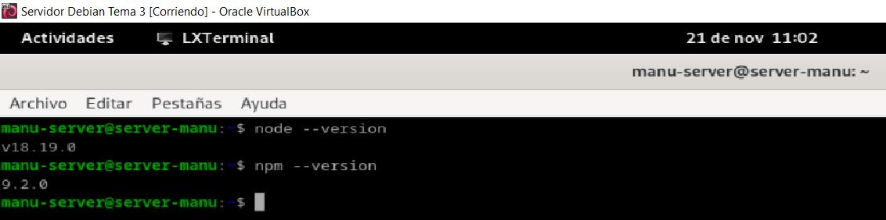
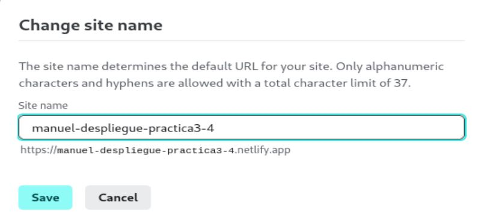
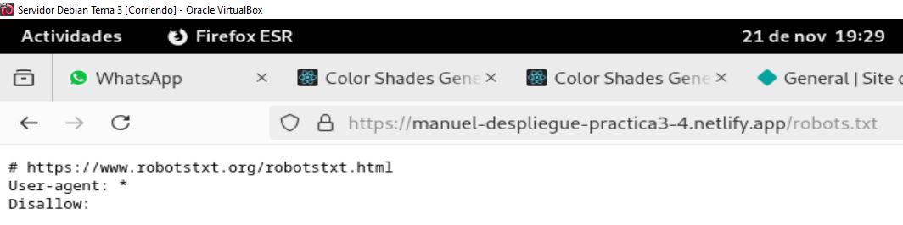

**Autor: Manuel Gómez Ruiz**

**Asignatura: Despliegue de Aplicaciones Web**

**Fecha: 21/11/2024**

**Curso: 2º de Desarrollo de Aplicaciones Web**

## Práctica 3.2: Despliegue de aplicaciones con Node Express

### Introducción

Detén el servicio de Tomcat para evitar problemas, con el comando **sudo systemctl stop tomcat10.service**.


### Instalación de Node.js, Express y test de la primera aplicación

Actualizamos los repositorios de la máquina virtual, con el comando **sudo apt update**.


Instalamos los repositorios **nodejs** y **npm** para poder después instalar y utilizar el plugin **express.js**, para ello usa el comando **sudo apt -y install nodejs npm**.


Comprobación de que se han instalado correctamente.



Usando **npm** instalamos el plugin **express**, comando **sudo npm install -g express**.


Crea un nuevo repositorio, accede a él e inicializa un nuevo proyecto usando npm.


Instala **express** para este proyecto local, comando **npm install express**.


Crea el archivo de muestra **app.js** y accede al archivo que se habrá creado al inicializar el proyecto y añade el contenido que aparece a continuación.

```
const express = require('express')
const app = express()
const port = 3000

app.get('/', (req, res) => {
    res.send('Hello. Welcome to this blog')
})

app.listen(port, () => {
    console.log(`Example app listening at http://localhost:${port}`)
})
```


Despliega el proyecto con el comando **node app.js** y visualiza los resultados.


### Despliegue de una nueva aplicación

Vamos ahora a realizar el despliegue de una aplicación de terceros para ver cómo es el proceso.

Clonar el repositorio a nuesta máquina, con el comando **git clone https://github.com/contentful/the-example-app.nodejs.git**:


Instalamos las librerias necesarias, para ello introduce el comando **npm install** y vuelve en 10 minutos.


Despliega la aplicación web con el comando **npm run start:dev**.


### Cuestiones

Cuando ejecutáis el comando npm run start:dev, lo que estáis haciendo es ejecutar un script:

**¿Donde podemos ver que script se está ejecutando?**

En el archivo **package.json** de tu proyecto.

**¿Qué comando está ejecutando?**

Esta ejecutando el comando **node ./bin/www**.


### Práctica 3.4: Despliegue de una aplicación React en Netlify (PaaS)

Nos crearemos un directorio para albergar la aplicación con el nombre que queramos. En ese directorio, crearemos los 3 archivos (dos .html y un .js) que conformarán nuestra sencilla aplicación de ejemplo:


### Creación de nuestra aplicación

Al primer archivo lo llamaré **head.html** y tendrá el siguiente contenido:


El segundo será llamado **tail.html**.


El script será llamado **aplicacion.js**.


Como hacemos siempre a la hora de crear una apliación usando **Node.js**, inicializamos el proyecto, con el comando **npm init**.


Corremos el programa para probar en local que funciona perfectamente, comando **node aplicacion.js**.


En **package.json** sustituye la línea dentro del bloque **script** añadiendo la línea de **"start": "node aplicacion.js"** para evitar problemas y que nos funcione en la plataforma PaaS.


### Aplicación para Netlify

Puesto que el interés en este módulo radica en el proceso de despliegue, suponiendo que la parte de desarrollo ya es abordada en otros módulos, vamos a utilizar una aplicación de ejemplo que nos ahorre tiempo para centrarnos en el despliegue.

Clonamos el repositorio **color-shades-generator**.


### Proceso de despliegue en Netlify

### Despliegue mediante CLI

Instalamos el CLI de Netlify **netlify-cli**.


Iniciamos sesión en Netlify, comando **netlify login**.


Vete a tu perfil, entra en OAuth y crea una nueva clave de acceso.


Copiamos y guardamos el token devuelto.


Exportamos el token y lo establecemos como variable de entorno.


Volvemos a iniciar sesión.


Bueno, tenemos el código de nuestra aplicación, tenemos nuestra cuenta en Netlify y tenemos el CLI necesario para ejecutar comandos desde el terminal en esa cuenta... ¿Podemos proceder al despliegue sin mayores complicaciones?

La respuesta es NO, como buenos desarrolladores y en base a experiencias anteriores, ya sabéis que hay que hacer un build de la aplicación para, posteriormente, desplegarla. Vamos a ello.

En primer lugar, como sabemos, debemos instalar todas las dependencias que vienen indicadas en el archivo **package.json**:

Instalamos npm, comando **npm install**.


Creamos una versión del proyecto optimizada para producción, con el comando **npm run build**.


Desplegamos el proyecto usando Netlify con el comando **netlify deploy**.


Accede a la URL que aparece en **Website draft URL**.


Desplegamos de nuevo, pero esta vez usando **netlify deploy --prod**, para obtener una url más clara.


Accede a la URL que aparece en **Website URL**.


### Despliegue mediante conexión con Github

Borramos nuestro sitio de Netlify para evitar cualquier problema o conflicto.


Eliminamos nuestro directorio personal **color-shades-generator**, para así poder empezar de 0, comando **rm -rf**.


Clonar nuevo proyecto con **wget https://github.com/StackAbuse/color-shades-generator/archive/refs/heads/main.zip**.


Crea un nuevo repositorio y descomprime lo descargado anteriormente con **wget**, comando **unzip** para descomprimir.


Crea un nuevo repositorio en GitHub.


Inicializa el repositorio personal descargado.


Haz un nuevo commit con los cambios.


Referencia la carpeta local con el repositorio recién creado en github, con el comando **git remote add** y después introduce **git push -u origin main** para subir el contenido del commit.


Importa el repositorio creado en Github desde Netlify.


Le indicamos que no acceda a todos nuestros repositorios sino sólo al repositorio que necesitamos.


Introducimos el nombre de nuestro sitio y desplegamos la aplicación.


Cuando finalice el despliegue cambia el nombre de tu sitio web añadiéndole tu nombre.



Lo que hemos conseguido de esta forma es que, cualquier cambio que hagamos en el proyecto y del que hagamos commit y push en Github, automáticamente genere un nuevo despliegue en Netlify. Es el principio de lo que más adelante veremos como despliegue continuo.

Comprueba si puedes acceder al archivo **robots.txt** desde el navegador utilizando la URL de tu sitio en Netlify.



Modificar archivo **robots.txt** para que incluya tu nombre, este archivo está dentro de la carpeta **public**.


Haz un nuevo **commit** y **push**, para subir los cambios realizados en el archivo **robot.txt** a tu repositorio de GitHub.


Comprueba en el dashboard de Netlify que se ha producido un nuevo deploy de la aplicación hace escasos segundos


Accede a **robots.txt** desde el navegador y comprueba que, efectivamente, se ve reflejado el cambio.

