**Autor: Manuel Gómez Ruiz**

**Asignatura: Despliegue de Aplicaciones Web**

**Fecha: 22/11/2024**

**Curso: 2º de Desarrollo de Aplicaciones Web**

##  Práctica 3.3: Despliegue de una aplicación Flask(Python)

### Procedimiento completo para el despliegue

Primero actualizamos los repositorios de paquetes del sistema y procedemos a instalar Nginx, utilizamos los siguientes comandos: **sudo apt update** y **sudo apt install nginx -y**.

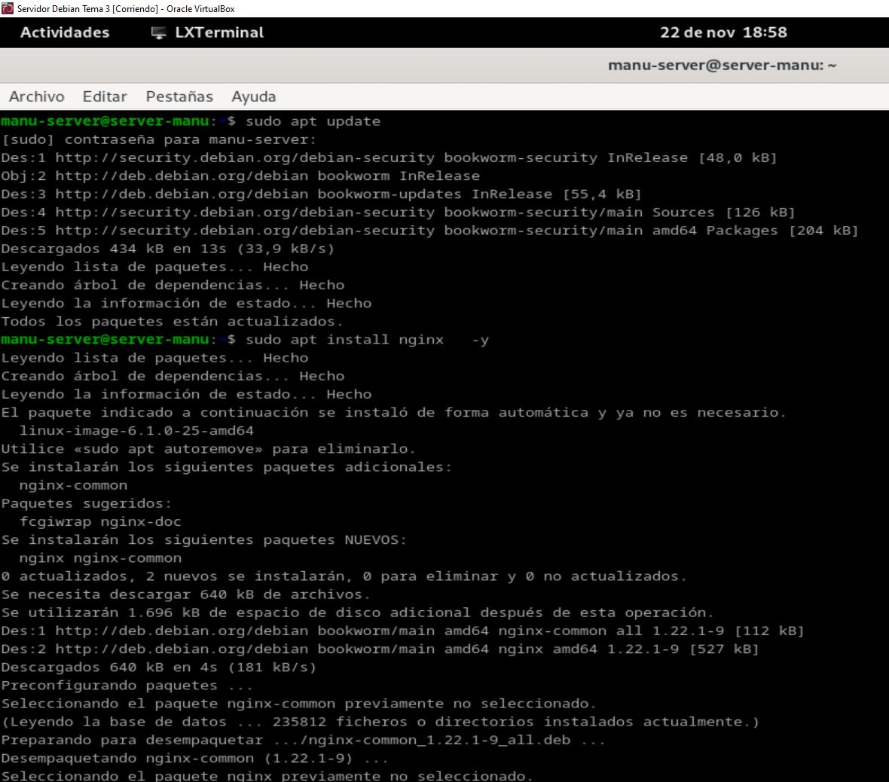

Instalación de Python y de su gestor de paquetes **pip**, este paquete proporciona las herramientas necesarias para instalar y gestionar paquetes de Python 3, utiliza el comando **sudo apt install python3-pip**.

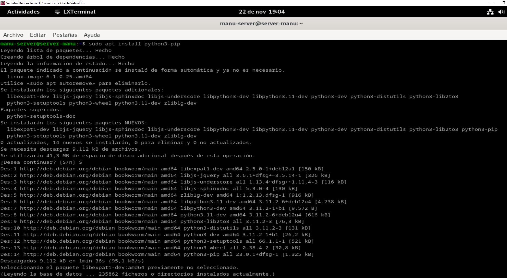

Instalamos el paquete **pipenv** que permite crear y gestionar entornos virtuales para proyectos de Python, mediante el comando **sudo apt install pipenv**.

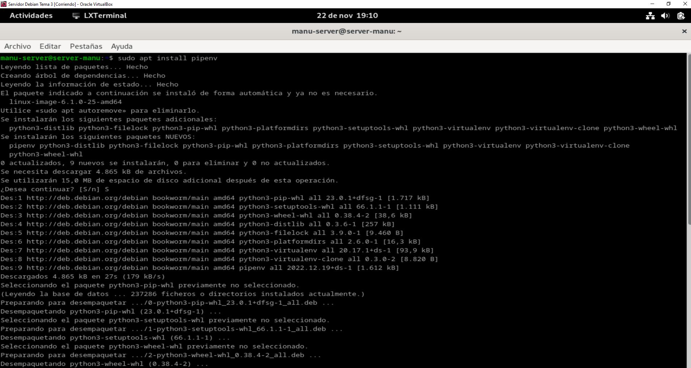

Después de la instalación, verificamos que **pinev** se ha instalado correctamente, mediante el comando **pipenv --version**.

Creamos un nuevo directorio con el comando **sudo mkdir nombre-directorio**, accedemos al directorio y verificamos sus permisos, con el comando **ls -lh** que mostrará la información sobre el propietario y los permisos asociados al directorio, como hemos utilizado **sudo** al crear la carpeta, el propietario sera **root**.

Hay que cambiar los permisos del directorio para que el dueño sea nuestro usuario y pertenezca al grupo ***www-data**, y establecemos los permisos adecuados a este directorio, para que pueda ser leído por todo el mundo, comandos **sudo chown -R $USER:www-data /var/www/mi_aplicacion** y **chmod -R 755 /var/www/mi_aplicacion**.

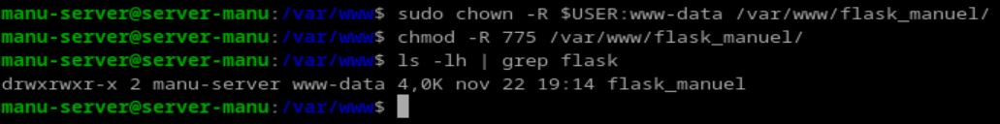

Creamos el archivo **.env** en el directorio del proyecto. Este archivo es importante para definir variables de entorno, como la aplicación de Flask y el modo de entorno.

Configuramos el archivo **.env** con las directivas necesarias para la aplicación de Flask. En este caso, configuramos la variable de entorno **FLASK_APP** que especifica el archivo que contiene la aplicación Flask y **FLASK_ENV** que define el entorno de ejecución, como desarrollo o producción.

Usamos el comando **pipenv shell** para activar el entorno virtual gestionado por **pipenv**, este comando nos coloca dentro de un entorno virtual donde podemos instalar y gestionar dependencias de Python.

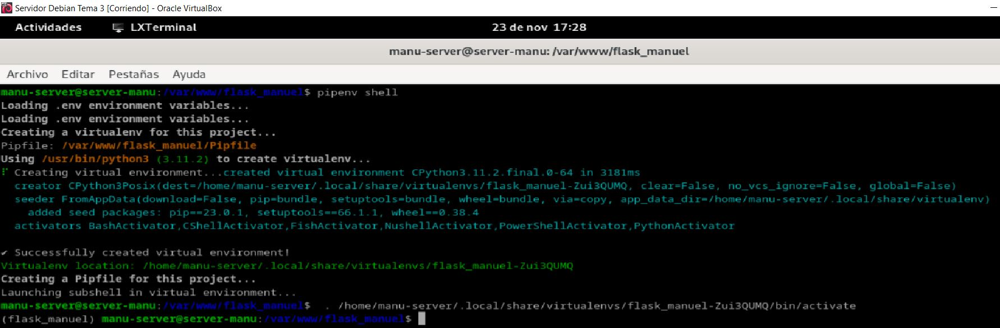

Con el entorno virtual activado, instalamos Flask y Gunicorn, que es un servidor WSGI para aplicaciones web de Python. Gunicorn se utiliza en producción para ejecutar aplicaciones Flask de manera eficiente, utiliza el comando **pipenv install flask gunicorn** para descargar e instalar las dependencias necesarias dentro del entorno virtual.

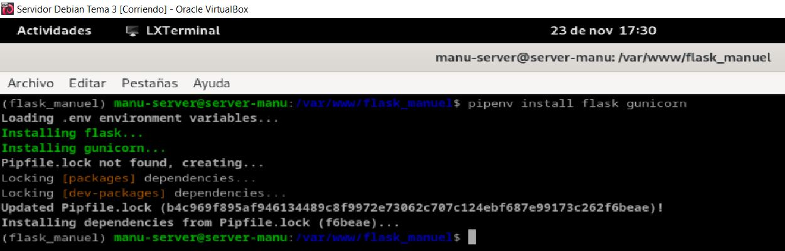

Creamos los archivos **application.py** en donde se define la aplicación Flask y **wsgi.py** archivo que Gunicorn usará para servir la aplicación.

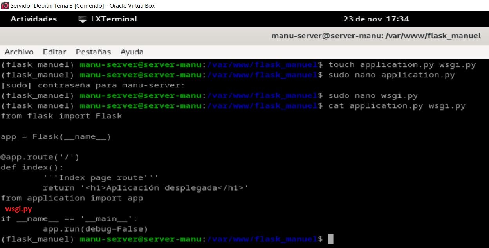

Una vez que la aplicación y los archivos necesarios están configurados, ejecutamos el servidor de desarrollo Flask usando Gunicorn con el comando **flask run --host '0.0.0.0'**, que lanzará la aplicación **Flask** y hace que sea accesible en todas las interfaces de red de la máquina (no solo en localhost).

Muestra que la aplicación Flask se ejecuta correctamente en el servidor y es accesible.

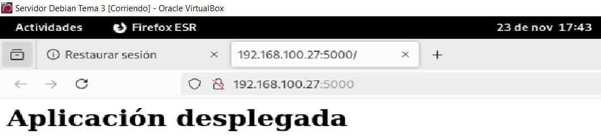

Comprobamos ahora que Gunicorn funciona correctamente también, debéis usar el comando **gunicorn --workers 4 --bind 0.0.0.0:5000 wsgi:app** para probar que la aplicación funciona correctamente usando Gunicorn.

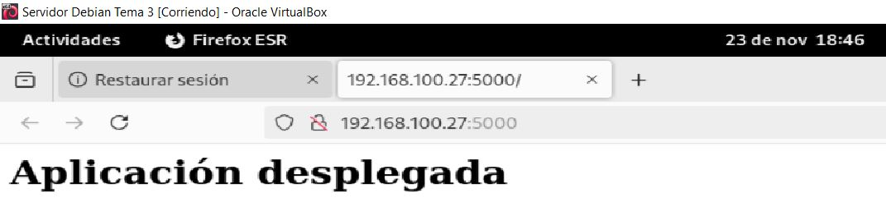

Dentro de nuestro entorno virtual, debemos tomar nota de cual es el path o ruta desde la que se ejecuta **gunicorn** para poder configurar más adelante un servicio de sistema, utiliza el comando **which gunicorn**.

Salimos de nuestro entorno virtual con el comando **deactivate**.

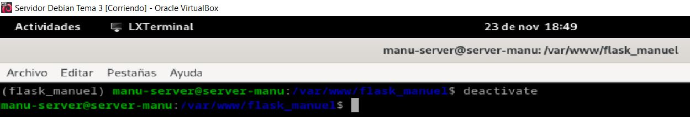

Inicializamos **Nginx** y comprobamos que esté ejecutandose correctamente, con los comandos **sudo systemctl start nginx** y **sudo systemctl status nginx**.

Antes de ello debemos parar el servicio **Apache** si esta usando el puerto 80, mediante los comandos **sudo systemctl disable apache2** y **sudo systemctl stop apache2**.

Creamos un archivo para que **systemd** corra **Gunicorn** como un servicio del sistema más.

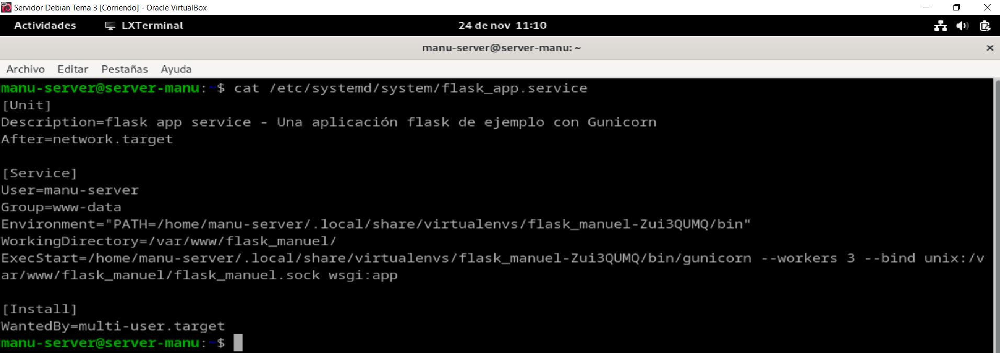

Ahora habilita e inicia el servicio nuevo en **systemd**, mediante los comandos **systemctl enable nombre_servicio** y **systemctl start nombre_servicio**.

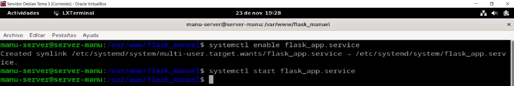

Creamos un archivo con el nombre de nuestra aplicación y dentro establecemos la configuración para ese sitio web.

Creamos el enlace simbólico del archivo para activar el sitio web y nos aseguramos de que se haya creado correctamente, con los comandos **sudo ln -s /etc/nginx/sites-available/nombre_aplicacion /etc/nginx/sites-enabled/** y **ls -l /etc/nginx/sites-enabled/ | grep nombre_aplicacion**.

Comprueba que no haya habido errores de sintaxis y reinicia el servicio.

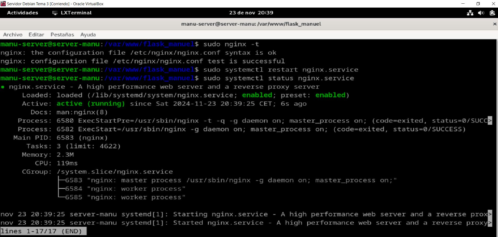

Edita el archivo **/etc/hosts** de la máquina anfitriona y añade la **IP** de la máquina virtual junto a su **server_name**, después comprueba el resultado en la máquina anfitriona.

### Clonación nuevo repositorio y procedimiento de despliegue

Ahora vamos a clonar el repositorio **git clone https://github.com/raul-profesor/Practica-3.5** dentro de nuestra carpeta **/var/www/**.

Creamos el archivo **.env** dentro de la carpeta clonada.

Cambiamos al usuario y grupo dueños del directorio y le añadimos permisos a la carpeta, con los comandos **sudo chown -R** y **chmod -R**.

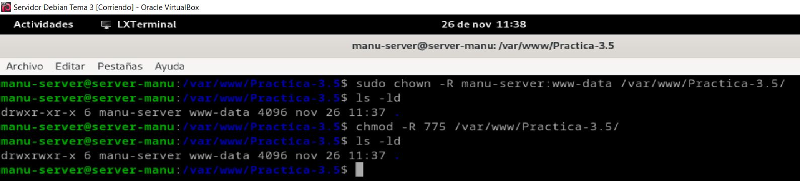

Crea un nuevo entorno virtual y descarga e instala las dependencias **flask gunicorn**, con los comandos **pipenv shell** y **pipenv install flask gunicorn**.

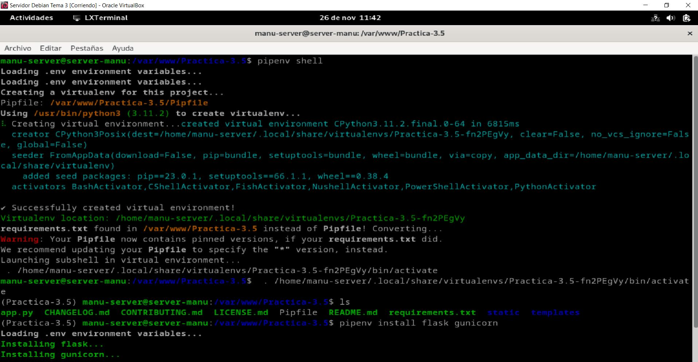

Ejecutamos el servidor de desarrollo Flask usando Gunicorn con el comando **flask run --host '0.0.0.0'**, que lanzará la aplicación **Flask** y hace que sea accesible en todas las interfaces de red de la máquina (no solo en localhost).

Muestra que la aplicación Flask se ejecuta correctamente en el servidor y es accesible.

Dentro de nuestro entorno virtual, debemos tomar nota de cual es el path o ruta desde la que se ejecuta **gunicorn** para poder configurar más adelante un servicio de sistema, utiliza el comando **which gunicorn**

Salimos de nuestro entorno virtual con el comando **deactivate**.

Creamos un archivo para que **systemd** corra **Gunicorn** como un servicio del sistema más.

Creamos un nuevo archivo con el nombre de nuestra nueva aplicación y dentro establecemos la configuración para ese sitio web.

Ahora habilita e inicia el servicio nuevo en **systemd**, mediante los comandos **systemctl enable nombre_servicio** y **systemctl start nombre_servicio**.

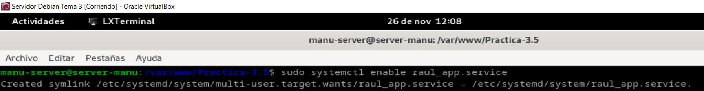

Reiniciamos **Nginx** y comprobamos que esté ejecutandose correctamente, con los comandos **sudo systemctl restart nginx** y **sudo systemctl status nginx**.

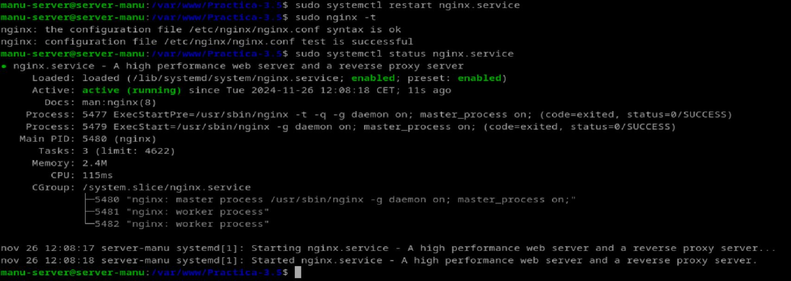

Creamos el nueov enlace simbólico del archivo para activar el sitio web y nos aseguramos de que se haya creado correctamente, con los comandos **sudo ln -s /etc/nginx/sites-available/nombre_aplicacion /etc/nginx/sites-enabled/** y **ls -l /etc/nginx/sites-enabled/ | grep nombre_aplicacion**.

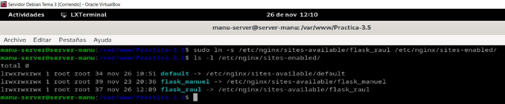

Edita el archivo **/etc/hosts** de la máquina anfitriona y añade la **IP** de la máquina virtual junto a su **server_name**, después comprueba el resultado en la máquina anfitriona.

Mostramos que se visualiza correctamente el repositorio al acceder desde el navegador de nuestra máquina anfitriona a **www.flask_raul**.

### Cuestiones

### Cuestión 1

**Busca, lee, entiende y explica qué es y para que sirve un servidor WSGI.**

Estándar en Python que define cómo un servidor web debe comunicarse con las aplicaciones web escritas en Python. Su propósito es permitir que las aplicaciones web basadas en Python se ejecuten de manera eficiente sobre un servidor web, actuando como un intermediario entre el servidor web y la aplicación. El servidor WSGI se encarga de manejar las solicitudes del cliente, pasarlas a la aplicación web, y luego enviar de vuelta la respuesta al cliente.