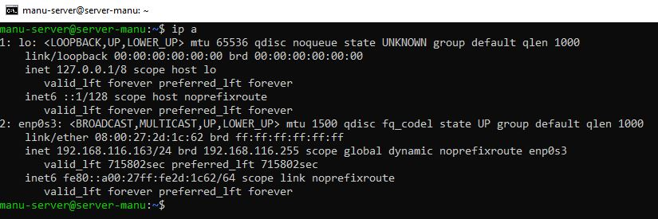
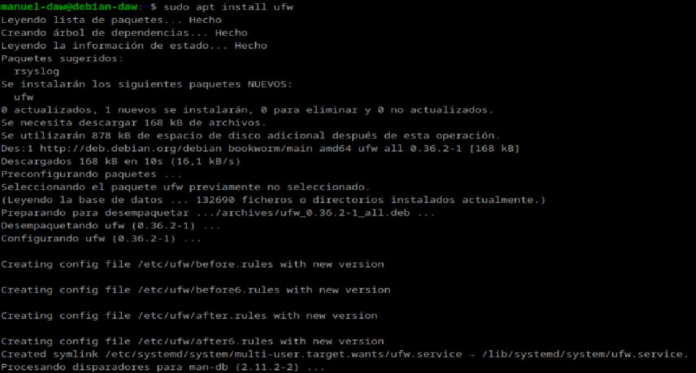
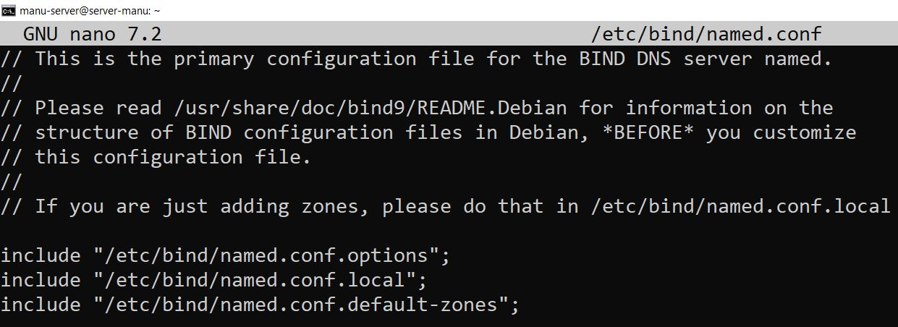
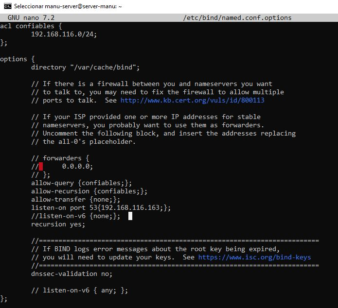
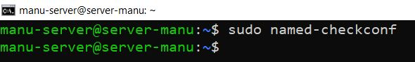

**Autor: Manuel Gómez Ruiz**

**Asignatura: Despliegue de Aplicaciones Web**

**Fecha: 14/01/2024**

**Curso: 2º de Desarrollo de Aplicaciones Web**

## Práctica 4.1: Configuración de un servidor DNS

### Nota importante

Antes de empezar la práctica, recuerda eliminar las entradas del archivo **/etc/hosts** para asegurar que la resolución de nombres va a nuestro servidor DNS.

En mi caso no las he eliminado, sino que las he comentado por si tengo que usarlas en el futuro, es lo mismo ya que dejan de ejecutarse en el script al comentarlas.


### IPS DEL SERVIDOR Y CLIENTE

He usado el comando **ip a** para mostrar mis datos de configuración de red tanto del servidor como del cliente, y que sea más fácil entender los siguientes pasos.

**La IP de mi servidor DNS es 192.168.116.163**



**La IP de mi cliente es 192.168.116.169**


Habilita el puerto 53 tanto para el servidor como para el cliente, para ello antes debes instalar el paquete **ufw** para gestionar los puertos, comandos **sudo apt install ufw** y **sudo ufw allow 53**.




### Instalación de servidor DNS

Vamos a utilizar el paquete Bind que es una herramienta de software libre para plataformas Unix y Linux, y que es estándar para servidores DNS.

Para instalarlo introduce el comando: **sudo apt-get install bind9 bind9utils bind9-doc**.


### Configuración del servidor

Accedemos al archivo **named.conf** dentro de **/etc/default** y modificamos la línea **OPTIONS** para indicar que solo queremos configurar y usar IPv4.

Comando para acceder al archivo: **sudo nano /etc/default/named** y modificamos la línea **OPTIONS** con **OPTIONS = "-u bind -4"** para que sólo use IPv4.


Acceso al archivo de configuración principal del servidor DNS Bind. En este archivo se define como se comporta el servidor y que otros archivos de configuración se incluirán, en este caso se incluye el archivo **named.conf.options** para configuraciones globales, como *opciones de red* y *directivas generales del servidor* y **named.conf.local** donde se definen las *zonas directas* e *inversas* para dominios personalizados. 

Comando **sudo nano /etc/bind/named.conf**.



### Configuración named.conf.options

Hacemos una copia de seguridad antes de modificar el archivo de configuración **named.conf**, para evitar posibles problemas.

Comando **sudo cp /etc/bind/named.conf.options /etc/bind/named.conf.options.backup**.


Editamos el archivo **named.conf.options** y incluimos por motivos de seguridad, una lista de acceso para que solo puedan realizar consultas recursivas al servidor aquellos hosts que decidamos, denegamos las transferencias de zona, configuramos el puerto DNS 53 con nuestra IP de red privada, y comentamos la última línea **listen-on-v6 { any;};**.

```
    Archivo /etc/bind/named.conf.options

    acl confiables {
        192.168.116.0/24;
    };

    options {
        directory "/var/cache/bind";

        // If there is a firewall between you and nameservers you want
        // to talk to, you may need to fix the firewall to allow multiple
        // ports to talk.  See http://www.kb.cert.org/vuls/id/800113

        // If your ISP provided one or more IP addresses for stable
        // nameservers, you probably want to use them as forwarders.
        // Uncomment the following block, and insert the addresses replacing
        // the all-0's placeholder.

        // forwarders {
        //      0.0.0.0;
        // };
        allow-query {confiables;};
        allow-recursion {confiables;};
        allow-transfer {none;};
        listen-on port 53{192.168.116.163;};
        //listen-on-v6 {none;};
        recursion yes;

        //========================================================================
        // If BIND logs error messages about the root key being expired,
        // you will need to update your keys.  See https://www.isc.org/bind-keys
        //========================================================================
        dnssec-validation no;

        // listen-on-v6 { any; };
    };
```



Comprobamos que la configuración del archivo anterior es correcta, con el comando **sudo named-checkconf**, si no devuelve nada esta correcto, en caso contrario devolverá la línea donde ocurrió el error.



Reiniciamos el servicio **named** y comprobamos que su estado es correcto.

Comandos: **sudo systemctl restart named** y **sudo systemctl status named**.


### Configuración named.conf.local

Accedemos a este archivo que está dentro de **/etc/bind/** y definimos una nueva zona, con un servidor DNS maestro y la ubicación del archivo de zona directa que después crearemos.

Comando: **sudo nano /etc/bind/named.conf.local**.

```
    Archivo /etc/bind/named.conf.local

    //
    // Do any local configuration here
    //

    // Consider adding the 1918 zones here, if they are not used in your
    // organization
    //include "/etc/bind/zones.rfc1918";

    zone "manuelgom.es" {   
            type master;    //  Define esta zona como principal
            file "/ect/bind/db.manuelgom.es"; // Ruta donde ubicamos nuestro archivo de zona
    };
```


### Creación del archivo de zona

Creamos el archivo de **zona de resolución directa** en el directorio previamente indicado y con el mismo nombre, esta zona será la **encargada de traducir nombres de dominio en direcciones IP.**

Los registros SOA detallan aspectos de la zona autoritativa, los NS indican los servidores DNS de la zona, en mi caso **ns1.manuelgom.es** es el servidor responsable de mi zona, y los A asignan un subdominio a las IPs respectivas para resolver consultas relacionadas con ese nombre, en mi caso usaré un subdominio distinto del servidor para el cliente, ya que es lo más adecuado.

Comando: **sudo nano /etc/bind/manuelgom.es**.


```
    Archivo /etc/bind/db.manuelgom.es

    $TTL    604800
    @       IN      SOA     ns1.manuelgom.es. admin.manuelgom.es. (
                    2025011610 ;Serial
                    3600       ;Refresh
                    1800       ;Retry
                    604800     ;Expire
                    86400      ;Negative Cache TTL
            )

        ;Definimos el servidor de nombres
        IN      NS      ns1.manuelgom.es.

    ;Definimos la IP del servidor de nombre y del cliente
    ns1     IN      A       192.168.116.163
    www     IN      A       192.168.116.169
```

### Creación del archivo de zona para la resolución inversa


Ahora debemos de modificar el archivo **named.conf.local** y añadir las líneas correspondientes a la **zona inversa**, que será la **encargada de traducir direcciones IP a nombres de dominio.**

Comando: **sudo nano /etc/bind/named.conf.local**.

```
    Archivo /etc/bind/named.conf.local

    //
    // Do any local configuration here
    //

    // Consider adding the 1918 zones here, if they are not used in your
    // organization
    //include "/etc/bind/zones.rfc1918";

    zone "manuelgom.es" {
            type master;
            file "/etc/bind/db.manuelgom.es"; // Ruta donde ubicamos nuestro archivo de zona
    };

    zone "116.168.192.in-addr.arpa" {
            type master;
            file "/etc/bind/db.116.168.192"; // Ruta donde ubicamos nuestro archivo de zona inversa
    };
```


Creamos el archivo de configuración SOA para la zona inversa, y definimos el servidor de nombres, y el valor del último octeto de bits en decimal, tanto del servidor como del cliente con un registro PTR, que convierte la dirección IP al nombre de dominio.

Comando **sudo nano /etc/bind/db.116.168.192**

```
    Archivo /etc/bind/db.116.168.192

    $TTL    604800
    @       IN      SOA     ns1.manuelgom.es. admin.manuelgom.es. (
                    2025011604 ;Serial
                    3600       ;Refresh
                    1800       ;Retry
                    604800     ;Expire
                    86400      ;Negative Cache TTL
            )

            ;Definimos el servidor de nombres
            IN      NS      ns1.manuelgom.es.

    ; Registros PTR
    163     IN      PTR     ns1.manuelgom.es.
    169     IN      PTR     www.manuelgom.es.
```


### Comprobación de las configuraciones

Comprobación de la zona de resolución inversa, con el comando **sudo named checkzone db.116.168.192**.


Comprobación de la zona de resolución directa, con el comando **sudo named checkzone db.manuelgom.es db.116.168.192**.


Reiniciamos el servicio y comprobamos que su estado sea correcto, **sudo systemctl restart named** y **sudo systemctl status named**.


**Atención. Es muy importante que el cliente esté configurado para usar como servidor DNS el que acabamos de instalar y configurar. Ya sea Windows, ya sea Linux, debéis cambiar vuestra configuración de red para que la máquina con la que hagáis las pruebas utilice este servidor DNS como el principal.**

Añadimos el DNS de nuestro servidor en el cliente, modificando el archivo **/etc/hosts**, en este archivo deja tu puerta de enlace, y añade tu dominio DNS y su IP respectiva, y una vez nos aseguramos que la configuración es correcta, utiliza el comando **sudo chattr +i /etc/hosts** para hacer inmutable el archivo de configuración y que no se modifique por el servicio **NetworkManager** cuando reiniciemos el adaptador de red o la máquina, para reiniciar el adaptador y asegurarnos de que los cambios se apliquen usa el comando **sudo systemctl restart networking.service**. 


### Comprobación de las resoluciones y las consultas

Podemos comprobar desde los clientes con nslookup y dig las resoluciones directa e inversa, comprobando el acceso a nuestro servidor DNS mediante los comandos **nslookup** y **dig**.

Resolución directa con nslookup.


Resolución inversa con nslookup.


Resolución directa con dig -x.


Resolución inversa con dig.


### Cuestiones finales

**Cuestión 1: ¿Qué pasará si un cliente de una red diferentes a la tuya intenta hacer uso de tu DNS de alguna manera, le funcionará?¿Por qué, en qué parte de la configuración puede verse?**

*No, debido a que en el archivo **/etc/bind/named.conf.options** le hemos indicado que los que pueden hacer uso de nuestro DNS son los dispositivos dentro de la red **192.168.116.0/24** mediante la **ACL confiables**.*

**Cuestión 2: ¿Por qué tenemos que permitir las consultas recursivas en la configuración?**

*Para permitir que nuestro servidor DNS actué como intermediario y realize búsquedas en otros servidores DNS, preguntándoles si conocen la IP asociada al recurso que está solicitando nuestro cliente, una vez que la encuentra el contenido es visible por pantalla.*

**Cuestión 3: El servidor DNS que acabáis de montar, ¿es autoritativo?¿Por qué?**

*Sí, porque queremos especificar información sobre nuestra zona DNS, como el servidor de nombre primario, el email del administrador, y varios temporizadores sobre como funcionará nuestro servicio, para ello debemos definir el servidor de nombre primario (SOA).*

**Cuestión 4: ¿Dónde podemos encontrar la directiva $ORIGIN y para qué sirve?**

*Transforma los nombre que no acaben en punto (nombre de dominio base) convirtiéndolos en nombres FQDN (fully qualified domain name).*

**Cuestión 5: ¿Una zona es idéntico a un dominio?**

*No, una zona es una parte del dominio que está gestionada por un servidor DNS.*

**Cuestión 6: ¿Pueden editarse los archivos de zona de un servidor esclavo/secundario?**

*No, los archivos de un servidor esclavo son obtenidos de otro servidor autorizado para la zona, normalmente, de un servidor maestro maestro mediante transferencia de zona, los ficheros son de solo lectura, por lo tanto, no se pueden modificar.*

**Cuestión 7: ¿Por qué podría querer tener más de un servidor esclavo para una misma zona?**

-   *Para reducir y repartir la carga entre varios servidores DNS.*
-   *Tener mayor torelancia a fallos. Si uno de los servidores falla, los esclavos pueden seguir    respondiendo las consultas de los clientes.*
-   *Ofrecer mayor rapidez, mejora el tiempo de respuesta en usuarios de otras regiones.*

**Cuestión 8: ¿Cuántos servidores raíz existen?**

*Existen 13 servidores raíz identificables por letras (de la A a la M), pero cada uno de ellos tienen copias distribuidas por todo el mundo mediante Anycast para garantizar su disponibilidad y rendimiento, tanto los servidores raíz como las copias son identificables mediante la misma IP.*

**Cuestión 9: ¿Qué es una consulta iterativa de referencia?**

*Es una respuesta parcial a la consulta, en la que nuestro servidor DNS indica otros servidores a los que se le puede consultar para resolver el nombre.*

**Cuestión 10: En una resolución inversa, ¿a qué nombre se mapearía la dirección IP 172.16.34.56?**

*56.34.16.172.in-addr.arpa*