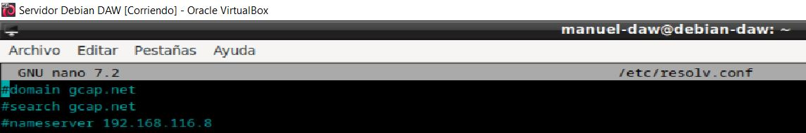
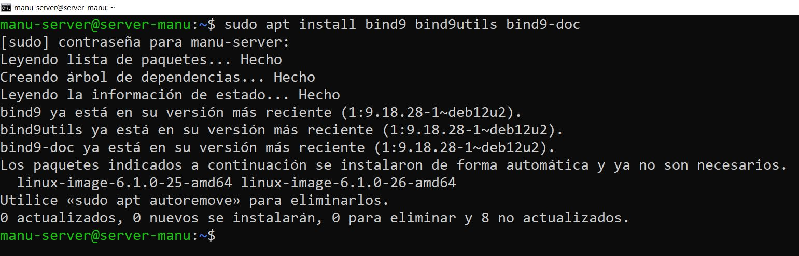
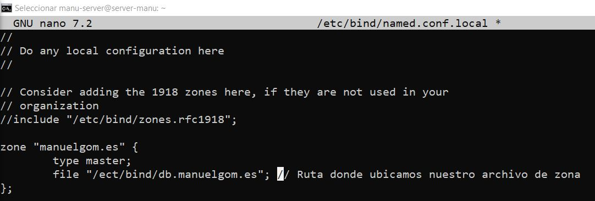
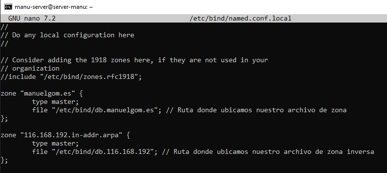
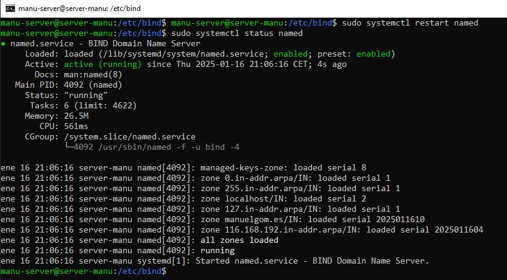

**Autor: Manuel Gómez Ruiz**

**Asignatura: Despliegue de Aplicaciones Web**

**Fecha: 12/12/2024**

**Curso: 2º de Desarrollo de Aplicaciones Web**

#   Práctica 4.1: Configuración de un servidor Nginx con Host Virtuales y directorios de usuario

El objetivo de esta práctica está en la configuración de un servidor Nginx que utilice host virtuales para alojar múltiples sitios web en un solo servidor y que cada host virtual apunte al directorio public_hml de distintos usuarios del sistema operativo Debian. De esta manera, cada usuario podrá gestionar su propio sitio web desde su carpeta personal.

Lo primero que debemos hacer es instalar el servidor **Nginx** y comprobar que su servicio está funcionando correctamente.

A continuación, permitimos el tráfico en los puertos 80 (HTTP) y 22 (SSH) para permitir el acceso a las páginas web.

##  Conexión al servidor

Para conectarnos por SSH desde nuestra máquina anfitriona, debemos de instalar el paquete **openssh-server** en nuestro servidor virtual Debian.

Una vez instalado, abrimos la terminal y nos conectamos a ella, mediante el comando **ssh nombre-usuario@IP**.

##  Usuarios y carpetas

### Creación de usuarios, carpetas y página web estática

Añadimos los dos usuarios y le introducimos su nueva contraseña segura, comandos **sudo useradd -m -s /bin/bash nombre-usuario** y **sudo passwd nombre-usuario**, la opción -m crea un directorio home para el nuevo usuario, mientras que -s crea una shell de inicio.

Accedemos con el primer usuario, creamos su carpeta y le asignamos sus permisos correspondientes sobre esa carpeta, el último comando es para validar los permisos sobre la carpeta.

Creamos una página web básica en formato HTML dentro de la carpeta recién creada. Esta página se utilizará como sitio web estático del usuario.

### Repetición de los mismos pasos para el segundo usuario

Repetimos el proceso de creación de carpeta, asignación de permisos y creación de la página web estática para el segundo usuario.

Comprobamos que nuestra página web se visualiza correctamente con nuestro archivo de configuración.

Resultado.

## Configuración de certificados SSL

Para mejorar la seguridad de las páginas web de los usuarios, creamos certificados SSL para ambos sitios web.

##  Archivos de Configuración de Nginx

Configuramos los archivos correspondientes para que Nginx sirva correctamente los sitios web de los usuarios. A continuación, mostramos las configuraciones realizadas para cada usuario:

## Creación de Enlaces Simbólicos y Reinicio del Servidor

Creamos los enlaces simbólicos para que Nginx apunte a los directorios de los usuarios y sus respectivas páginas web. Después de crear los enlaces, comprobamos la sintaxis de la configuración y reiniciamos el servidor para aplicar los cambios.

También permitimos el tráfico en el puerto 443, que es utilizado para HTTPS.

##  Resultados

Una vez completada la configuración, verificamos el funcionamiento de las páginas web de ambos usuarios:

Resultado con el usuario Antonio.

Resultado con el usuario Sergio.

