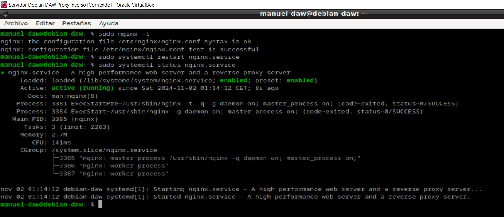
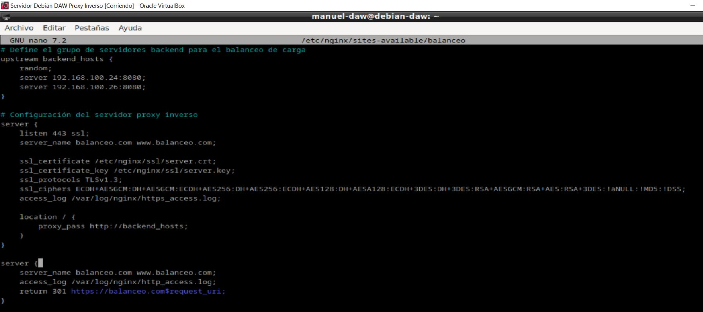

***Autor: Manuel Gómez Ruiz***

***Asignatura: Despliegue de Aplicaciones Web***

***Fecha: 02/11/2024***

***Curso: 2º de Desarrollo de Aplicaciones Web***

## Práctica 2.5 - Proxy inverso y balanceo de carga con SSL en NGINX

### Creación de certificado autofirmado

Creamos una carpeta llamada **ssl** dentro del directorio **/etc/nginx/**, este es un lugar común para almacenar los archivos de certificados y clave de SSL en servidores Nginx, facilitando la administración y organización.


Generamos un certificado SSL autofirmado y lo colocamos dentro de la carpeta **/etc/nginx/ssl**, un certificado autofirmado es útil para pruebas y entornos de desarrollo, ya que permite habilitar HTTPS sin tener que obtener un certificado de una autoridad de certificación (CA).

El certificado y la clave se generan mediante comandos como **openssl** y suelen guardarse como archivos **.crt** (certificado) y **.key** (clave privada)


### Configuración SSL en el proxy inverso

En nuestro servidor proxy cambiamos la configuración de nuestro archivo de configuración **/etc/nginx/sites-available/balanceo** para incluir las configuraciones necesarias para SSL:

- **listen 443 ssl;** : Hace que Nginx escuche en el puerto 443 (el estándar para HTTPS) y active SSL.

- **ssl_certificate** y **ssl_certificate_key** : Estas líneas especifican las rutas del certificado y la clave privada que generaste.

- **ssl_protocols** y **ssl_ciphers** : Estas líneas configuran los protocolos y cifrados permitidos para SSL, ayudando a asegurar las conexiones HTTPS.


Comprobamos que la sintaxis del archivo sea correcta y reiniciamos el servidor para aplicar los cambios.


### Comprobaciones

Después de configurar el proxy inverso con SSL, prueba acceder al sitio mediante **HTTPS**.

El certificado al estar autofirmado los navegadores podrían mostrar una advertencia, a pesar de que el tráfico entre el cliente y el servidor esté encriptado.


Comprobación de que podemos acceder a la página web y vemos el certificado.


### Redirección forzora a HTTPS

Configuramos una redirección automática de HTTP a HTTPS. Esto se logra añadiendo un bloque **server** separado en el archivo de configuración Nginx, que redirigirá todo el tráfico que intente acceder por el puerto 80 (HTTP) a ese puerto al puerto 443 (HTTPS). para ello añade en el archivo de configuración:

- **listen 80**

- **server_name**

- **return 301 https://$host$request_uri** : Realiza una redirección 301 permanente a la versión HTTPS del sitio. El **$host** y **$request_uri** garantizan que la redirección se mantenga en la misma URL a la que el usuario intentó acceder, pero usando HTTPS.


Comprobamos la sintaxis y reiniciamos para que los cambios surjan efecto.



### Tareas

- Eliminad del otro bloque **server {..}** las líneas que hagan referencia a escuchar en el puerto 80 (listen 80...).

Eliminar el puerto de escucha 80 del archivo de configuración hará que todos los intentos de entrada por puertos que no sean el 443 sean redirigidos a este.



- Reiniciad el servicio.


- Comprobad ahora que cuando entráis en **http://balanceo**, automáticamente os redirige a la versión segura de la web.

La configuración usada asegura que los usuarios siempre accedan a la versión segura del sitio sin importar cómo escriban la URL en sus navegadores, en mi caso escribí **http://www.balanceo.com**


- Comprobad que cuando realizáis una petición en el archivo de log **http_access.log** aparece la redirección 301 y que, de la misma manera, aparece una petición GET en **https_access.log**

En este archivo se registran las solicitudes que llegan al bloque **HTTP** (puerto 80) y son redirigidas a **HTTPS**. En este archivo, deberían aparecer registros de código 301, indicando la redirección, así como las peticiones GET que se realizaron a la versión **HTTPS** del sitio.


### Cuestionario

### Cuestión 1

**Hemos configurado nuestro proxy inverso con todo lo que nos hace falta pero no nos funciona y da un error de tipo This site can't provide a secure connection ERR_SSL_PROTOCOL_ERROR**.

Dentro de nuestro server block tenemos esto:

```
server {
    listen 443;
    ssl_certificate /etc/nginx/ssl/enrico-berlinguer/server.crt;
    ssl_certificate_key /etc/nginx/ssl/enrico-berlinguer/server.key;
    ssl_protocols TLSv1.3;
    ssl_ciphers ECDH+AESGCM:DH+AESGCM:ECDH+AES256:DH+AES256:ECDH+AES128:DH+AES:ECDH+3DES:DH+3DES:RSA+AESGCM:RSA+AES:RSA+3DES:!aNULL:!MD5:!DSS;
    server_name enrico-berlinguer;
    access_log /var/log/nginx/https_access.log;

    location / {
        proxy_pass http://red-party;
        }
    }
```
Falta el **ssl** en la segunda línea después de **listen 443**

### Cuestión 2

**Imaginad que intentamos acceder a nuestro sitio web HTTPS y nos encontramos con el siguiente error:**


Investigad qué está pasando y como se ha de solucionar.

Este error ocurre cuando el certificado SSL del sitio web se encuentra caducado, ha sido revocado por alguna razón, como una vulnerabilidad o el certificado no está configurado correctamente en el servidor.

Como posibles soluciones tenemos:

- Renovar el certificado.

- Contactar al proveedor de certificados si el certificado ha sido revocado, para obtener más detalles y resolver el problema.

- Revisar la configuración del servidor y reinicia el servidor, para asegurarte de que el certificado esté configurado correctamente en el servidor y se estén aplicando los cambios del archivo de configuración actualmente.