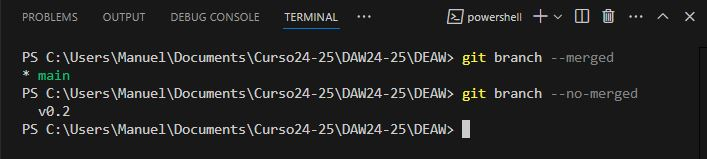

**Autor: Manuel Gómez Ruiz**

**Asignatura: Despliegue de Aplicaciones Web**

**Fecha: 03/02/2025**

##  Práctica 5.1: Ejercicios Git y GitHub

### Repositorio DEAW

**1. Crear un repositorio en vuestro GitHub llamado DEAW.**

*Dirigete a tu cuenta de GitHub, haz clic en el botón "New Repository", luego añade un nombre para el repositorio, el propietario, una breve descripción de su contenido y elige si será público o privado.*


**2. Clonar vuestro repositorio en local.**

*Para clonar un repositorio utiliza el comando ``git clone`` junto al enlace del repositorio terminado en .git*.

```

    Manuel@DESKTOP-3AN5HH7 MINGW64 ~/Documents/Curso24-25/DAW24-25
    $ git clone https://github.com/manuelgom5/DEAW.git
```


### README

**1. Crear (si no lo habéis creado ya) en vuestro repositorio local un documento ``README.md``.**

```
    Nota

    Escribir un pequeño texto en este README a propósito del repositorio y el módulo para el que se utilizará.
```

*Puedes utilizar el comando ``echo -e`` para introducir el texto del archivo a la misma vez que lo crea -> **echo -e "Capítulo 1: Introducción a Git\nCapítulo 2: Flujo de trabajo básico\n" > README.md***.


### Commit inicial

**1. Realizar un commit inicial con el comentario ``Comenzamos con los ejercicios de git``.**

*Como el archivo README.md aún no ha sido agregado al área de staging, debes utilizar ``git add`` para incluirlo en el seguimiento antes de realizar el commit. Si el archivo ya estuviera en **seguimiento** por Git, podría utilizar directamente ``git commit -am 'Mensaje'``*.


### Push inicial

**1. Subir los cambios al repositorio remoto.**

*Usa el comando ``git push`` para subir los cambios a la rama principal. Si es la primera vez que subes cambios a la rama, utiliza el flag ``-u`` para establecer una relación de seguimiento entre una rama local y su correspondiente rama remota, para que posteriormente no sea necesario utilizar en la rama comandos como ``git pull``*.


### Ignorar archivos

**1.  Crear en el repositorio local un fichero llamado ``privado.txt``.**

**2.  Crear en el repositorio local una carpeta llamada ``privada``.**

3.  Realizar los cambios oportunos para que tanto el archivo como la carpeta sean ignorados por git.

*Para crear el archivo, usa ``touch privado.txt``, y para la carpeta ``mkdir privada``, luego crea un archivo llamado ``.gitignore`` que incluya la ruta de ambos para que se vean y se puedan usar solo en local.*


### Añadir fichero1.txt

**1. Añadir fichero **1.txt** al repositorio local.**

*Para agregar el archivo al repositorio, primero añade el archivo al área de seguimiento con git add, ya que acaba de ser creado, agregale un mensaje con git commit -m y le haces un git push para enviar los cambios al repositorio remoto.*


*Comprobación de que está subido en GitHub.*


### Crear el tag v0.1

**1.  Crear un tag ``v0.1``**.

*Utiliza el comando git tag NombreTag*.


### Subir el tag v0.1

**1.  Subir los cambios al repositorio remoto.**

*Utiliza el comando git push origin nombreTag para agregarla a Github, aparecerá en el repositorio bajo el nombre de tags.*


### Cuenta de GitHub

**1.  Poner una foto en vuestro perfil de GitHub.**

*Dirigete a la sección de "Settings" y selecciona en editar tu foto.*


**2.  Poner el doble factor de autentificación en vuestra cuenta de GitHub.**

*Ve a "Settings" > "Password and Authentication", y configura un método adicional para proteger tu cuenta. Esto asegurará que, al acceder desde tu equipo o cualquier otro dispositivo, necesitarás un segundo factor de verificación, como el acceso a tu móvil, para confirmar tu identidad y realizar acciones sensibles en tu cuenta.*


### Uso social de GitHub

**1.  Preguntar los nombres de usuario de GitHub de 2 de tus compañeros de clase, búscalos y sigueles.**

*En "Your Profile" puedes ver a las personas que estás siguiendo y a quienes te siguen. Si haces clic sobre sus nombres, podrás ver más detalles de sus perfiles.*


**2.  Seguir los repositorios ``DEAW`` del resto de tus compañeros.**

*Para seguir un repositorio, accede a él y haz clic en el botón "Watch". En mi caso, he seleccionado recibir notificaciones cada vez que haya cambios, menciones o comentarios en el repositorio de mi compañero.*


**3.  Añadir una estrella a los repositorios ``DEAW`` del resto de tus compañeros.**

*El botón para añadir estrellas se encuentra junto al botón de seguimiento del repositorio. Los repositorios a los que des una estrella se pueden visualizar en la sección "Your profile".*


### Crear una tabla

**1.  Crear una tabla de este estilo en el fichero ``README.md`` con la información de varios de tus compañeros de clase:**


*En README puedes crear una tabla utilizando la sintaxis adecuada.*


*Como puedes ver, GitHub es capaz de interpretar el formato de la tabla en el archivo README y la muestra en formato tabla.*


### Colaboradores

**1.  Poner a ``github.com/arammes003`` como colaborador del repositorio ``DEAW``.**

*Para hacerlo, accede a los ajustes (Settings) de tu repositorio > Collaborators, y añade su nombre de usuario.*


### Notas

**1.  Este ejercicio es continuación del anterior por lo que tendreís que seguir trabajando en el repositorio ``DEAW``.**

**2.  También tendreís que ir poniendo los ``comandos`` que habéis tenido que utilizar durante todos los ejercicios y las ``explicaciones y capturas de pantalla`` que consideréis ``necesarias`` en el informe.**

### Crear una rama v0.2

**1.  Crear una rama ``v0.2``.**

**2.  Posiciona tu carpeta de trabajo en esta rama.**

*Puedes realizar ambas acciones a la vez utilizando el comando ``git checkout -b nombreRama``*.


### Añadir fichero 2.txt

**1.  Añadir un fichero ``2.txt`` en la rama ``v0.2``.**

*También puedes hacerlo con echo -e, como te mostré previamente.*


### Crear rama remota v0.2

**1.  Subir los cambios al repositorio remoto.**

*Puedes subir la rama y su contenido haciendo uso del comando ``git push origin NombreRama``*


*Como puedes ver, ahora existe la rama en GitHub.*


### Merge directo

**1.  Posicionarse en la rama ``main``**.


**2.  Hacer un merge de la rama ``v0.2`` en la rama ``main``**

*De esta manera, los cambios realizados en tu rama ``v0.2`` se integran en la rama principal (``main``).*


### Merge con conflicto

**1.  En la rama ``main`` poner ``Hola`` en el fichero ``1.txt`` y hacer commit.**


**2.  Posicionarse en la rama ``v0.2`` y poner ``Adios`` en el fichero ``"1.txt"`` y hacer commit.**

*Sobreescribimos la misma línea con un nuevo contenido y guardamos el archivo.*


**3.  Posicionarse de nuevo en la rama ``main`` y hacer un merge con la rama ``v0.2``.**

*Como se puede visualizar esto llevará a un conflicto, ya que el archivo tiene contenido distinto en ambos commits.*


### Listado de ramas

**1.  Listar las ramas con merge y las ramas sin merge.**

*Para listar las ramas que ya han sido mergeadas, utiliza ``git branch --merged``. Para listar las ramas que aún no han sido mergeadas, utiliza ``git branch --no-merged``*.



### Arreglas conflictos

**1.  Arreglar el conflicto anterior y hacer un commit.**

*Resolvemos el conflicto eligiendo mantener ambas modificaciones en líneas separadas. Luego, realizamos un commit utilizando ``git commit -am`` para agregar el archivo sin conflictos y guardarlo.*


### Borrar rama

**1.  Crear un tag ``v0.2``**.

*Utiliza el comando ``git tag NombreTag`` para crear el nuevo tag*.


**2.  Borrar la rama ``v0.2``**.

*Para eliminar una rama, debemos borrarla tanto localmente como de manera remota. Usa ``git branch -d NombreRama`` para eliminarla localmente y ``git push origin --delete NombreRama`` para borrarla del repositorio remoto.*


### Listado de cambios

**1.  Listar los distintos commits con sus ramas y sus tags.**

*El comando git log --oneline --decorate --graph --all muestra cada commit en una sola línea, con todas sus referencias (nombres ramas, tags, merges)*


### Referencias

[Pro Git book, written by Scott Chacon and Ben Straub and published by Apress](https://git-scm.com/book/es/v2)

##   Práctica 5.2: Ejercicios Git y GitHub

```
    Nota

    Cuando se habla de **zona de intercambio temporal** o zona **staging**, estamos hablando de un add

    

    Si tenéis dudas para realizar estos ejercicios, podéis consultar la [siguiente web](https://aprendeconalf.es/docencia/git/manual/)
```

##  Enunciados: Ejercicios de creación y actualización de repositorios

### Ejercicio 1

**Configurar Git definiendo el nombre del usuario, el correo electrónico y activar el coloreado a la salida.**

*Para que Git asocie correctamente los commits a nuestra identidad, debemos configurar el nombre de usuario y el correo electrónico con los comandos ``git config --global user.name`` y ``user.email``, y para mejorar la legibilidad de los mensajes, podríamos activar el coloreado con ``git config --global color.ui auto``*.


**Mostrar la configuración final.**

*Con el comando ``git config --global --list`` podemos comprobar que los datos se han introducido correctamente.*


### Ejercicio 2

**Crear un repositorio nuevo con el nombre ``libro`` y mostrar su contenido.**

*Usa ``mkdir NombreRepo`` para crearlo, luego accede a él con ``cd`` e inicializa el repositorio con ``git init``.*


*Para mostrar su contenido utiliza el comando ``ls -la``*.


### Ejercicio 3

**Comprobar el estado del repositorio.**

*Uso del comando ``git status``*.


**Crear un fichero ``indice.txt`` con el siguiente contenido:**

``Capítulo 1: Introducción a Git``
``Capítulo 2: Flujo de trabajo básico``
``Capítulo 3: Repositorios remotos``

*Crea la rama main y accede a ella con ``git branch -M main``, después crea el fichero y su contenido con ``echo -e`` y muestra su contenido con ``cat``*.


**Comprobar de nuevo el estado del repositorio.**


**Añadir el fichero a la zona de intercambio temporal.**


**Volver a comprobar una vez más el estado del repositorio.**


### Ejercicio 4

**Realizar un commit de los últimos cambios con el mensaje ``"Añadido índice del libro"``, y ver el estado del repositorio.**


### Ejercicio 5

**Cambiar el fichero ``indice.txt`` para que contenga lo siguiente:**

``Capítulo 1: Introducción a Git``
``Capítulo 2: Flujo de trabajo básico``
``Capítulo 3: Gestión de ramas``
``Capítulo 4: Repositorio de ramas``

*Comando ``echo -e``*.


**Mostrar los cambios con respecto a la última versión guardada en el repositorio.**

*Comando ``git diff NombreArchivo``*.


**Hacer un commit de los cambios con el mensaje ``"Añadido capítulo 3 sobre gestión de ramas"``.**


### Ejercicio 6

**Mostrar los cambios de la última versión del repositorio con respecto a la anterior.**

*Comando ``git diff HEAD~1``*.


**Cambiar el mensaje del último commit por ``"Añadido capítulo 3 sobre gestión de ramas al índice"``.**


**Volver a mostrar los últimos cambios del repositorio.**


## Ejercicios de manejo del historial de cambios

### Ejercicio 1

**Mostrar el historial de cambios del repositorio.**

*Comando ``git log``*,


**Crear la carpeta capitulos y crear dentro de ella el fichero capitulo1.txt con el siguiente texto.***

``Git es un sistema de control de versiones ideado por Linus Torvalds.``

*Comandos mkdir para agregar la carpeta, y echo para crear el fichero con su contenido*.


**Añadimos los cambios a la zona de intercambio temporal.**


**Hacer un commit de los cambios con el mensaje "Añadido capítulo 1." Volver a mostrar el historial de cambios del repositorio.**


### Ejercicio 2

**Crear el fichero ``capitulo2.txt`` en la carpeta capitulos con el siguiente texto.**

``El flujo de trabajo básico con Git consiste en: 1- Hacer cambios en el repositorio. 2- Añadir los cambios a la zona de intercambio temporal. 3- Hacer un commit de los cambios.``


**Añadir los cambios a la zona de intercambio temporal.**


**Hacer un commit de los cambios con el mensaje "Añadido capítulo 2."**


**Mostrar las diferencias entre la última versión y dos versiones anteriores.**


### Ejercicio 3

**Crear el fichero ```capitulo3.txt`` en la carpeta capitulos con el siguiente texto.**

``Git permite la creación de ramas lo que permite tener distintas verisones del mismo proyecto y trabajar de manera simultanea en ellas.``


**Añadir los cambios a la zona de intercambio temporal.**


**Hacer un commit de los cambios con el mensaje "Añadido capítulo 3."**


**Mostrar las diferencias entre la primera y la última versión del repositorio.**


### Ejercicio 4

**Añadir al final del fichero ``indice.txt`` la siguiente línea:**

``Capítulo 5: Conceptos avanzados``


**Añadir los cambios a la zona de intercambio temporal.**


**Hacer un commit de los cambios con el mensaje "Añadido capítulo 5 al indice.".**


**Mostrar quién ha hecho cambios sobre el fichero ``indice.txt``.**


## Ejercicios de deshacer cambios

### Ejercicio 1

Eliminar la última línea del fichero ``indice.txt`` y guardarlo.


Comprobar el estado del repositorio.


Deshacer los cambios realizados en el fichero ``indice.txt`` para volver a la versión anterior del fichero.


Volver a comprobar el estado del repositorio.


### Ejercicio 2

Eliminar la última línea del fichero ``indice.txt`` y guardarlo.


Añadir los cambios a la zona de intercambio temporal.


Comprobar de nuevo el estado del repositorio.


Quitar los cambios de la zona de intercambio temporal, pero mantenerlos en el directorio de trabajo.


Comprobar de nuevo el estado del repositorio.


Deshacer los cambios realizados en el fichero ``indice.txt`` para volver a la versión anterior del fichero.


Volver a comprobar el estado del repositorio.


### Ejercicio 3

Eliminar la última línea del fichero ``indice.txt`` y guardarlo.


Eliminar el fichero ``capitulos/capitulo3.txt``.


Añadir un fichero nuevo ``capitulos/capitulo4.txt`` vacío.


Añadir los cambios a la zona de intercambio temporal.


Comprobar de nuevo el estado del repositorio.


Quitar los cambios de la zona de intercambio temporal, pero mantenerlos en el directorio de trabajo.


Comprobar de nuevo el estado del repositorio.


Deshacer los cambios realizados para volver a la versión del repositorio.


Volver a comprobar el estado del repositorio.


### Ejercicio 4

Eliminar la última línea del fichero ``indice.txt`` y guardarlo.


Eliminar el fichero ``capitulos/capitulo3.txt``.


Añadir los cambios a la zona de intercambio temporal y hacer un commit con el mensaje "Borrado accidental."


Comprobar el historial del repositorio.


Deshacer el último commit pero mantener los cambios anterioes en el directorio de trabajo y la zona de intercambio temporal.


Comprobar el historial y el estado del repositorio.


Volver a hacer el commit con el mismo mensaje de antes.


Deshacer el último commit y los cambios anteriores del directorio de trabajo volviendo a la versión anterior del repositorio.


Comprobar de nuevo el historial y el estado del repositorio.


## Ejercicios de gestión de ramas

### Ejercicio 1

Crear una nueva rama bibliografia y mostrar las ramas del repositorio.


### Ejercicio 2

Crear el fichero ``capitulos/capitulo4.txt`` y añadir el texto siguiente:

En este capítulo veremos como usar GitHub para alojar repositorios en remoto.


Añadir los cambios a la zona de intercambio temporal.


Hacer un commit con el mensaje "Añadido capítulo 4."


Mostrar la historia del repositorio incluyendo todas las ramas.


### Ejercicio 3

Cambiar a la rama bibliografia.


Crear el fichero ``bibliografia.txt`` y añadir la siguiente referencia:

``Chacon, S. and Straub, B. Pro Git. Apress.``


Añadir los cambios a la zona de intercambio temporal.


Hacer un commit con el mensaje "Añadida primera referencia bibliográfica."


Mostrar la historia del repositorio incluyendo todas las ramas.


### Ejercicio 4

Fusionar la rama bibliografia con la rama main.


Mostrar la historia del repositorio incluyendo todas las ramas.


Eliminar la rama bibliografia.


Mostrar de nuevo la historia del repositorio incluyendo todas las ramas.


### Ejercicio 5

Crear la rama bibliografia.


Cambia a la rama bibliografia.


Cambiar el fichero ``bibliografia.txt`` para que contenga las siguientes referencias:

``Scott Chacon and Ben Straub. Pro Git. Apress.
Ryan Hodson.Ry's Git Tutorial. Smashwords (2014)``


Añadir los cambios a la zona de intercambio temporal y hacer un commit con el mensaje "Añadida nueva referencia bibliográfica".


Cambiar a la rama main.


Cambiar el fichero ``bibliografia.txt`` para que contenga las siguientes referencias:

``Chacon, S. and Straub, B. Pro Git Apress.
Loeliger, J. and McCullough, M. Version control with Git. O´Reilly.``


Añadir los cambios a la zona de intercambio temporal y hacer un commit con el mensaje "Añadida nueva referencia bibliográfica."


Fusionar la rama bibliografia con la rama main.


Resolver el conflicto dejando el fichero ``bibliografia.txt`` con las referencias:

``Chacon, S. and Straub, B. Pro Git. Apress
Loeliger, J. and McCullough, M. Version control with Git. O´Reilly
Hodson, R. Ry´s Git Tutorial. Smashwords (2014)``


Añadir los cambios a la zona de intercambio temporal y hacer un commit con el mensaje "Resuelto conflicto de bibliografía"


Mostrar la historia del repositorio incluyendo todas las ramas.


## Ejercicios de repositorios remotos

### Ejercicio 1

Crear un nuevo repositorio público en GitHub con el nombre ``libro-git``.


Añadirlo al repositorio local del libro.


Mostrar todos los repositorios remotos configurados.


### Ejercicio 2

Añadir los cambios del repositorio local al repositorio remoto de GitHub.


Acceder a GitHub y comprobar que se han subido los cambios mostrando el historial de versiones.


### Ejercicio 3

Colaborar en el repositorio remoto ``libro-git`` de otro usuario.


Clonar su repositorio ``libro-git``.


Añadir el fichero ``autores.txt`` que contenga el nombre de usuario y su correo electrónico.


Añadir los cambios a la zona de intercambio temporal.


Hacer un commit con el mensaje "Añadido autor."


Subir los cambios al repositorio remoto.


### Ejercicio 4

Hacer una bifurcación del repositorio remoto ``asalber/libro-git`` en GitHub.


Clonar el repositorio creado en la cuenta de GitHub del usuario.


Crear una nueva rama autoria y activarla.


Añadir el nombre de usuario y su correo al fichero ``autores.txt``.


Añadir los cambios a la zona de intercambio temporal.


Hacer un commit con el mensaje "Añadido nuevo autor."


Subir los cambios de la rama autoria al repositorio remoto en GitHub.


Hacer un Pull Request de los cambios en la rama autoria.

