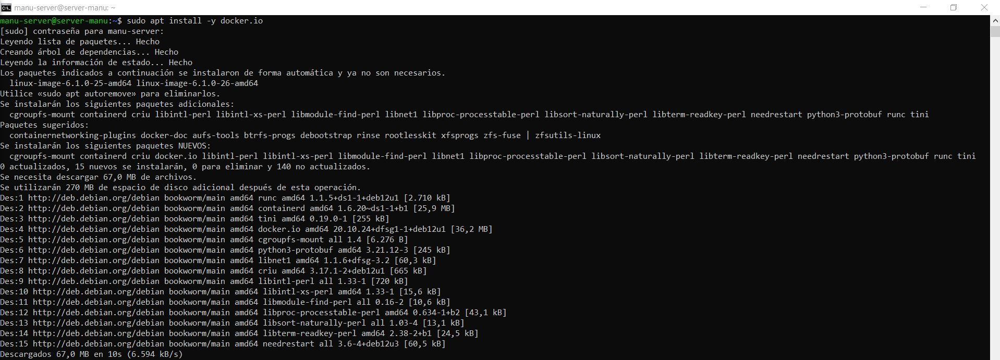
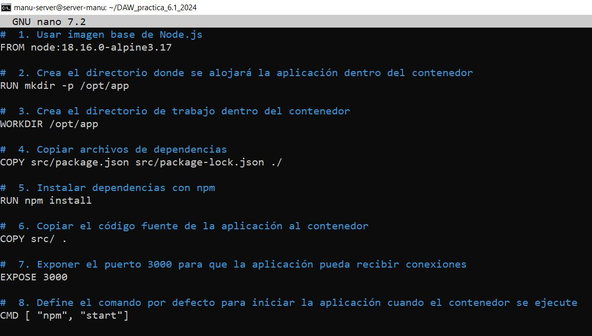
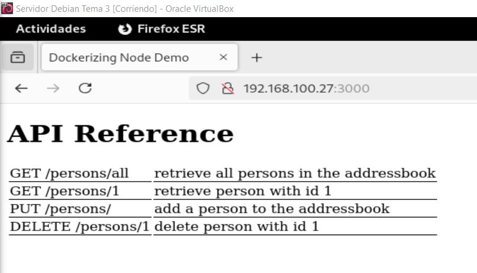
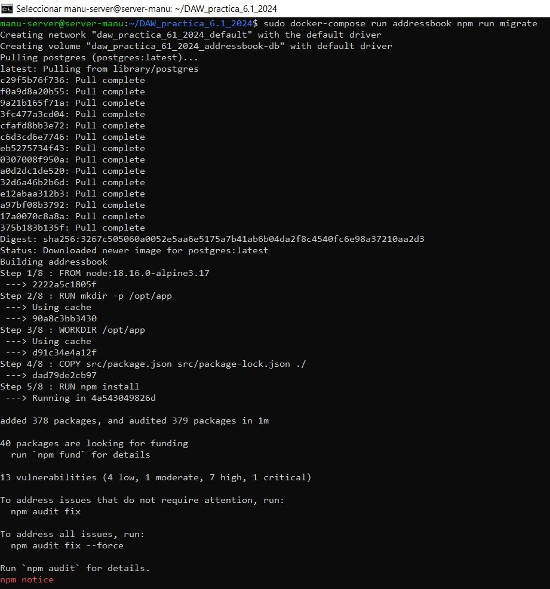

**Autor: Manuel Gómez Ruiz**

**Asignatura: Despliegue de Aplicaciones Web**

**Fecha: 11/02/2025**

#   Práctica 6.1: Dockerización del despliegue de una aplicación Node.js

El objetivo de esta práctica es aprender a **dockerizar y desplegar una aplicación Node.js** que gestiona un **libro de direcciones con PostgreSQL** como base de datos.

##  Despliegue con Docker

Para comenzar con la práctica, vamos a clonar un repositorio con el código fuente de una aplicación y el archivo ``Dockerfile``, ejecutando el comando **git clone https://github.com/raul-profesor/DAW_practica_6.1_2024.git**.

Este comando descargará todo el contenido del repositorio en nuestro equipo, permitiéndonos modificar y construir la aplicación.


### Configuración dockerfile

Si accedemos dentro del repositorio clonados, podremos encontrar el archivo ``Dockerfile``. Sin embargo, este archivo está incompleto y requiere modificaciones para que funcione correctamente.

```
____ node:18.16.0-alpine3.17
____  mkdir -p /opt/app
_____ /opt/app
____ src/package.json src/package-lock.json .
___ npm install
____ src/ .
_______ 3000
___ [ "npm", "start"]
```



### Construcción de imagen

Una vez corregido el ``Dockerfile``, nos movemos dentro del directorio clonado y procedemos a construir la imagen del Docker. Para ello, ejecutamos los siguientes comandos:

```
cd DAW_practica_6.1_2024
docker build -t librodirecciones .
```

Este comando construirá la imagen asignándole el nombre ``librodirecciones`` en el directorio actual.



### Ejecución del contenedor

Ya construida, podremos ejecutar la aplicación dentro de un contenedor con el comando **docker run -p 3000:3000 -d librodirecciones**.


Este comando inicia un contenedor en segundo plano basado en la imagen ``librodirecciones``, asignando el puerto 3000 del contenedor al puerto 3000 de nuestra máquina.

### Prueba desde el navegador

Después de iniciar el contenedor, intentamos acceder a la aplicación mediante su **dirección IP** y **puerto**.

Para ello, accede a la terminal y usa el comando **ipconfig** para visualizar tu IP, en mi caso es la **192.168.100.13**.


Accedo a mi máquina cliente y accedo usando el navegador a **http://192.168.100.13:3000**.


### Docker Compose

**Docker compose** es una herramienta para gestionar aplicaciones multicontenedor, que sirve para iniciar y detener múltiples contenedores en secuencia, conectar contenedores utilizando una red virtual, construir o descargar imágenes de contenedores, etcétera.

**Docker compose** utiliza un archivo de definición YAML, que es un formato de serialización de datos para la configuración de aplicaciones.



Para levantar nuestra aplicación basada en contenedores tendríamos que utilizar el comando **docker compose run adressbook npm run migrate**, el servicio **adressbook** es una base de datos definida en el archivo ``docker-compose.yml`` y el comando ``npm run migrate`` se usa para ejecutar migraciones de base de datos en una aplicación Node.js.


Después utilizaremos **docker compose up --build -d**, que construye las imágenes de los servicios definidos en el archivo ``docker-compose.yml`` y levanta los contenedores en segundo plano.


Comprobar el estado de los contenedores, comando **docker compose ps**, este comando muestra los contenedores que están siendo gestionados por **Docker Compose** y su estado actual.



Y por último usamos **docker compose run addressbook npm test**, que ejecuta las pruebas de la aplicación dentro del contenedor **adressbook**. 


**Resultado del test**


### Tarea

Probad que la aplicación junto con la BBDD funciona correctamente. El funcionamiento de la API es:

Para ello desde la terminal de nuestra máquina física hacemos las siguientes peticiones:

-   ``GET /persons/all`` muestra todas las personas en el libro de direcciones.

-   ``GET /persons/1`` muestra la persona con el id 1.

-   ``PUT /persons/`` añade una persona al libro de direcciones.

-   ``DELETE /persons/1`` elimina la persona con el id 1.

Me da fallos ;(