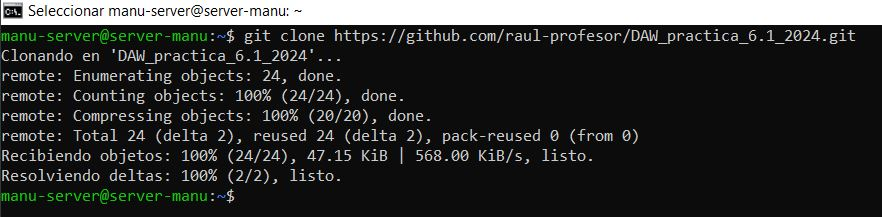
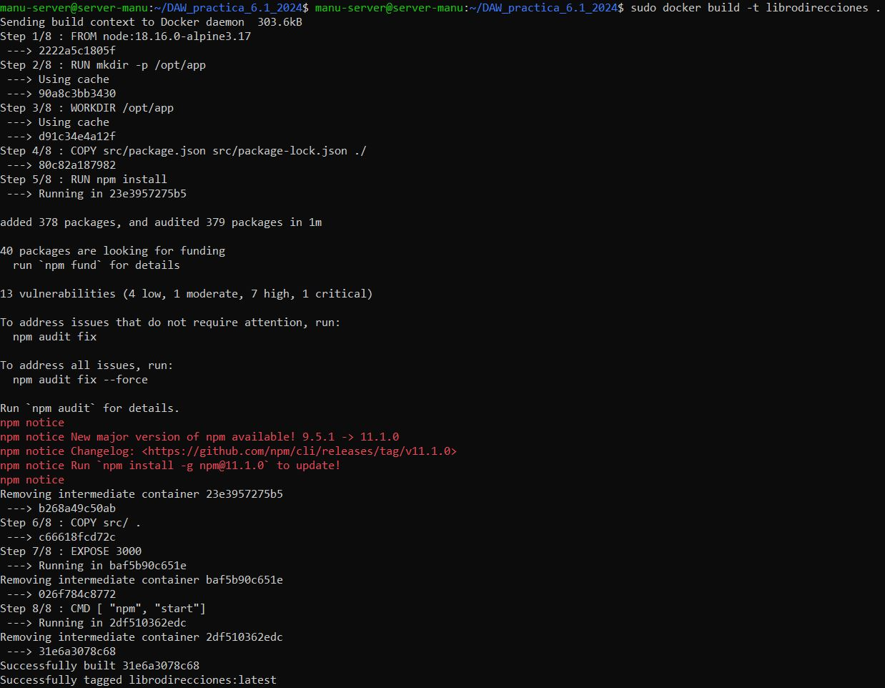
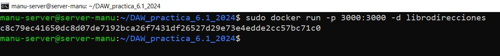
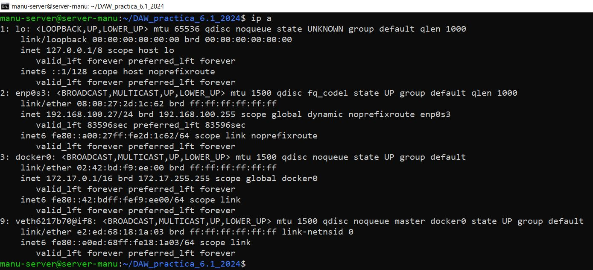
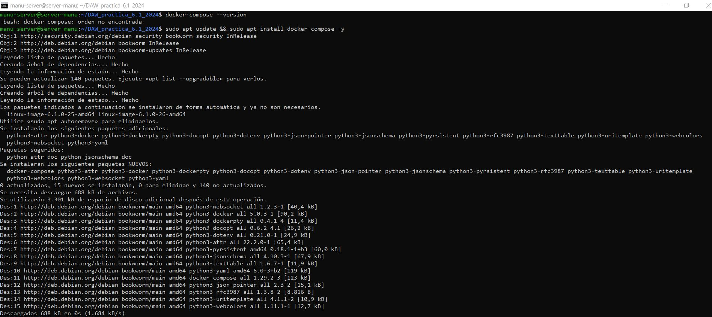
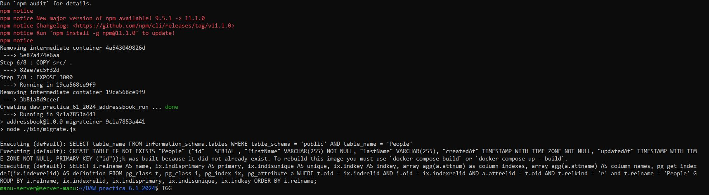

**Autor: Manuel Gómez Ruiz**

**Asignatura: Despliegue de Aplicaciones Web**

**Fecha: 11/02/2025**

#   Práctica 6.1: Dockerización del despliegue de una aplicación Node.js

El objetivo de esta práctica es aprender a **dockerizar y desplegar una aplicación Node.js** que gestiona un **libro de direcciones con PostgreSQL** como base de datos.

### Conexión por SSH

El primer paso es establecer una conexión **SSH** con nuestra máquina virtual, las conexiones **SSH** se utilizan para acceder de forma segura a otra máquina de manera remota a través de una red, para ello abre una terminal y escribe ``ssh NombreUsuario@SuIp``.


##  Despliegue con Docker

Para comenzar con la práctica, vamos a clonar un repositorio con el código fuente de una aplicación y el archivo **Dockerfile**, ejecutando el comando ``git clone https://github.com/raul-profesor/DAW_practica_6.1_2024.git``.

Este comando descargará todo el contenido del repositorio en nuestro equipo, permitiéndonos modificar y construir la aplicación.



Antes de seguir adelante, se deberá tener instalado Docker en el sistema. Para ello, ejecuta el comando ``sudo apt install -y docker.io``.


### Configuración dockerfile

Cuando se clone el repositorio, ya podremos navegar hasta su directorio con ``cd`` y listar su contenido con ``ls``. Entre los archivos, encontraremos el **Dockerfile**.

Si mostramos su contenido con ``cat``, veremos que está incompleto y necesita modificaciones para que funcione correctamente.

```
____ node:18.16.0-alpine3.17
____  mkdir -p /opt/app
_____ /opt/app
____ src/package.json src/package-lock.json .
___ npm install
____ src/ .
_______ 3000
___ [ "npm", "start"]
```

Así que vamos a acceder al archivo **Dockerfile** con ``nano`` y a modificarlo.


### Construcción de imagen

Una vez corregido el **Dockerfile**, procedemos a construir la imagen del Docker. Para ello, ejecutamos el comando: ``sudo docker build -t librodirecciones .``.

Este comando construirá la imagen asignándole el nombre **librodirecciones** en el directorio actual.



### Ejecución del contenedor

Ya construida, podremos ejecutar la aplicación dentro de un contenedor con el comando ``docker run -p 3000:3000 -d librodirecciones``.



Este comando inicia un contenedor en segundo plano basado en la imagen **librodirecciones**, asignando el puerto 3000 del contenedor al puerto 3000 de nuestra máquina.

### Prueba desde el navegador

Después de iniciar el contenedor, intentamos acceder a la aplicación mediante su **dirección IP** y **puerto**.

Para ello, usa el comando ``ipconfig`` para visualizar tu IP, en mi caso es la **192.168.100.27**.



Accede a tu máquina, abre el navegador e intenta acceder a **http://TU-IP:3000**, si te devuelve el mensaje **No se puede acceder a este sitio web**, abre el puerto 3000 con el comando ``sudo ufw allow 3000`` y vuelve a intentarlo.


### Docker Compose

**Docker Compose** es una herramienta para gestionar aplicaciones multicontenedor, que sirve para iniciar y detener múltiples contenedores en secuencia, conectar contenedores utilizando una red virtual, construir o descargar imágenes de contenedores, etcétera.

Es posible que no lo tengas instalado, para comprobarlo introduce el comando ``docker-compose --version`` y si no encuentra la orden escribe ``sudo apt install -y docker-compose``.



**Docker Compose** utiliza un archivo de definición YAML, que es un formato de serialización de datos para la configuración de aplicaciones.


Ya que el puerto 3000 está ocupado y lo estamos usando de nuevo en el archivo **docker-compose**, para el servicio **adressbook** asegurate de parar el contenedor anterior **librodirecciones** para evitar problemas, comando ``sudo docker stop librodirecciones``.

Para levantar nuestra aplicación basada en contenedores tendríamos que utilizar el comando ``docker-compose run adressbook npm run migrate``, el servicio **adressbook** es una base de datos definida en el archivo **docker-compose.yml** y el comando ``npm run migrate`` se usa para ejecutar migraciones de base de datos en una aplicación Node.js.




Después utilizaremos **docker-compose up --build -d**, que construye las imágenes de los servicios definidos en el archivo **docker-compose.yml** y levanta los contenedores en segundo plano.


Comprobar el estado de los contenedores, comando **docker compose ps**, este comando muestra los contenedores que están siendo gestionados por **Docker Compose** y su estado actual.


Y por último usamos **docker compose run addressbook npm test**, que ejecuta las pruebas de la aplicación dentro del contenedor **adressbook**. 


**Resultado del test**


### Tarea

Probad que la aplicación junto con la BBDD funciona correctamente. El funcionamiento de la API es:

Para ello desde la terminal de nuestra máquina física hacemos las siguientes peticiones:

-  ``PUT /persons/`` añade una persona al libro de direcciones, ``curl -X PUT http://192.168.100.27:3000/persons -H 'Content-Type: application/json' -d '{"id": 2, "firstName": "Alfonso", "lastName": "Mestaza"}'``.


-   ``GET /persons/all`` muestra todas las personas en el libro de direcciones, ``curl -X GET http://192.168.100.27:3000/persons/all -H 'Content-Type: application/json'``.


-   ``GET /persons/1`` muestra la persona con el id 1, ``curl -X GET http://192.168.100.27:3000/persons/1 -H 'Content-Type: application/json'``.


-   ``DELETE /persons/1`` elimina la persona con el id 1.

