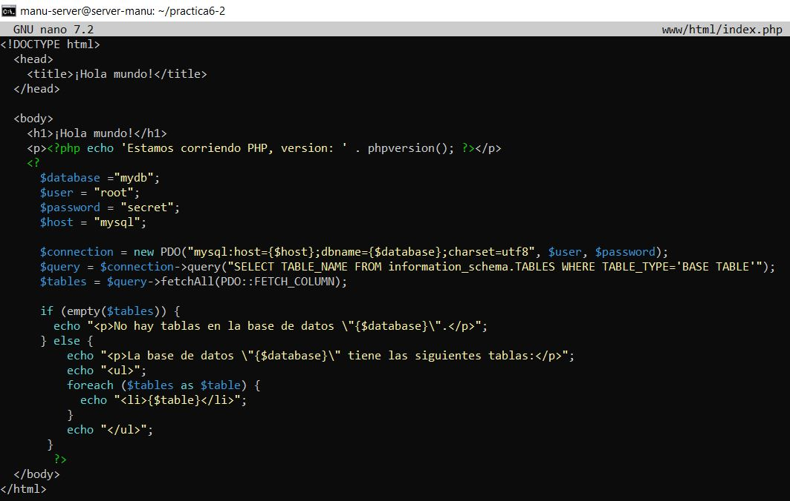

**Autor: Manuel Gómez Ruiz**

**Asignatura: Despliegue de Aplicaciones Web**

**Fecha: 13/02/2025**

#   Práctica 6.2: Despliegue de una aplicación PHP con Nginx y MySQL usando Docker y docker-compose

##  Proceso de dockerización de Nginx+PHP+MySQL

**Objetivo de la práctica**: Configurar una infraestructura de contenedores utilizando Docker Compose para crear un servicio web con **Nginx, PHP**, y una base de datos **MySQL**. La configuración también incluye la persistencia de datos de MySQL en un contenedor dedicado para almacenar las tablas de la base de datos.

### 1.  Estructura de directorios

Al finalizar esta práctica, nuestra estructura de directorios debe seguir la siguiente organización:

```
/usuario/home/practica6-2/
├── docker-compose.yml
├── nginx
│   ├── default.conf
│   └── Dockerfile
├── php
│   └── Dockerfile
└── www
    └── html
        └── index.php
```

Para ello, comenzaremos creando la estructura de directorios y archivos necesarios. Más adelante, editaremos su contenido.

Ejecuta los siguientes comandos para crearlos:

```
mkdir -p practica6-2/www/html
cd practica6-2
touch docker-compose.yml
mkdir nginx
cd nginx/
touch default.conf Dockerfile
cd ../
mkdir php
cd php/
touch Dockerfile
cd ../
cd www/html/
touch index.php
cd ../../
```


Ya hemos generado la estructura de archivos y carpetas necesarias, ahora vamos a visualizar la jerarquía de directorios con la herramienta **tree**, la cual antes debemos instalar con el comando ``sudo apt install tree``.


Al ejecutar el comando ``tree`` dentro del directorio **practica6-2**, puedes verificar que tu estructura coincida con la esperada.


### 2.  Creación de un contenedor Nginx

El primer paso en la configuración de nuestro entorno será desplegar un contenedor **Nginx**, que servirá para alojar nuestra aplicación **PHP**.

Para ello, editamos el archivo **docker-compose.yml** con el comando ``sudo nano docker-compose.yml``.

```
nginx:
  image: nginx:latest
  container_name: nginx-container
  ports:
    - 80:80
```


Este archivo descargará la última versión de la **imagen de Nginx** desde Docker Hub, crea un contenedor llamado **nginx-container** y expone el puerto **80**, mapeándolo al puerto **80** de nuestra máquina anfitriona, permitiendo el acceso desde el navegador.

Una vez guardado el archivo, ejecutamos el siguiente comando para desplegar el contenedor en segundo plano ``sudo docker compose up -d``.


Ahora debemos verificar si el contenedor se ha iniciado correctamente, utilizando el comando ``sudo docker ps``.


Finalmente, abrimos nuestro navegador en la máquina anfitriona, y accedemos a ``http://IP_SERVIDOR``. Si todo está correctamente configurado, veremos la página de bienvenida de Nginx.


### 3.  Creación de un contenedor PHP

Para ejecutar código PHP dentro de nuestro contenedor, primero necesitamos editar el contenido de nuestro **index.php**. Para ello, utiliza el comando ``sudo nano www/html/index.php`` y añade el siguiente contenido:

```
<!DOCTYPE html>
<head>
  <title>¡Hola mundo!</title>
</head>

<body>
  <h1>¡Hola mundo!</h1>
  <p><?php echo 'Estamos corriendo PHP, version: ' . phpversion(); ?></p>
</body>
```


Este archivo servirá como una prueba para comprobar que nuestro entorno PHP está funcionando correctamente.

### Configuración de Nginx para ejecutar PHP

Ahora debemos modificar el archivo de configuración de Nginx para permitir la ejecución de archivos PHP. Para ello, editamos **nginx/default.conf** con el comando ``sudo nano nginx/default.conf``.


Dentro del archivo, agregamos la siguiente configuración:

```
server {

    listen 80 default_server;  # Escucha en el puerto 80 como servidor predeterminado
    root /var/www/html;  # Define la raíz de los archivos que se servirán
    index index.html index.php;  # Define los archivos de índice que se buscarán en un directorio

    charset utf-8; # Codificación

    location / {
      # Intenta servir el archivo solicitado, si no existe, redirige a index.php
      try_files $uri $uri/ /index.php?$query_string;
    }

    # Excepciones para archivos favicon.ico y robots.txt para evitar registros innecesarios
    location = /favicon.ico { access_log off; log_not_found off; }
    location = /robots.txt { access_log off; log_not_found off; }

    # Desactiva los logs de acceso y define el log de errores
    access_log off;
    error_log /var/log/nginx/error.log error;

    # Desactiva el uso de sendfile (mejora compatibilidad entornos virtualizados)
    sendfile off;

    # Define el tamaño máximo permitido para subir archivos a 100MB
    client_max_body_size 100m;

    # Configuración para procesar archivos PHP
    location ~ .php$ {
      fastcgi_split_path_info ^(.+.php)(/.+)$;
      fastcgi_pass php:9000;
      fastcgi_index index.php;
      include fastcgi_params;
      fastcgi_param SCRIPT_FILENAME $document_root$fastcgi_script_name;
      fastcgi_intercept_errors off;
      fastcgi_buffer_size 16k;
      fastcgi_buffers 4 16k;
    }

    # Restringe el acceso a archivos .ht* por seguridad
    location ~ /.ht {
      deny all;
    }
    }
```


### Configuración del Dockerfile para Nginx

Accedemos al archivo **Dockerfile** dentro de la carpeta **Nginx**, para asegurarnos de que el contenedor de Nginx utilice nuestra configuración personalizada. Para ello, editamos el archivo con el comando ``sudo nano practica6-2/nginx/Dockerfile``.

Añade las siguientes instrucciones:

```
# Usamos la imagen oficial de Nginx en su última versión
FROM nginx:latest
# Copiamos nuestro archivo de configuración personalizado "default.conf" en el directorio Nginx
COPY ./default.conf /etc/nginx/conf.d/default.conf
```


### Modificación del docker-compose.yml

Accedemos a **docker-compose.yml** para incluir el servicio de PHP-FMP y enlazarlo con Nginx. Para ello usa el comando ``sudo nano docker-compose.yml``.

```
services:
  nginx:
    build: ./nginx/ # Construye la imagen con el Dockerfile dentro de la carpeta Nginx
    container_name: nginx-container
    ports:
      - 80:80 # Puerto de mapeo
    links:
      - php # Conectamos nginx con el contenedor PHP
    volumes:
      - ./www/html/:/var/www/html/  # Montamos la carpeta local www/html/ en /var/www/html dentro del contenedor

  php:
    image: php:7.0-fpm  # Usamos la imagen oficial de PHP con fastCGI Process Manager
    container_name: php-container
    expose:
      - 9000  # Exponemos el puerto 9000 para comunicación con Nginx
    volumes:
      - ./www/html/:/var/www/html/  # Montamos la carpeta www/html en var/www/html dentro del contenedor
```


Este fichero **docker-compose.yml** se creará un nuevo contenedor **PHP-FPM** en el **puerto 9000**, enlazará el contenedor Nginx con el contenedor PHP, así como creará un volumen y lo montará en el directorio /var/www/html de los contenedores.

Con todo esto configurado, ejecutamos nuevamente ``docker-compose`` para desplegar ambos contenedores:


Verificamos que ambos contenedores están en ejecución, utilizando el comando ``docker ps``.


Si todo está funcionando correctamente, podremos acceder a ``http://IP_SERVIDOR`` desde nuestro anfitrión y visualizar la salida del archivo ``index.php``, confirmando que PHP se está ejecutando dentro del contenedor.

### 4.  Creación de un contenedor para datos

Hasta ahora, hemos montado el directorio ``www/html`` en ambos contenedores (``nginx`` y ``php``). Sin embargo, esta no es la mejor práctica, ya que cada contenedor mantiene su propio sistema de archivos.

En esta sección, vamos a crear un **contenedor de datos** independiente llamado ``app-data``, que se encargará de almacenar los archivos de nuestra aplicación. Luego, este contenedor se enlazará con los otros servicios para compartir los datos de manera eficiente.

Primero edita el archivo **docker-compose.yml**  con el comando ``sudo nano /usuario/home/practica6-2/docker-compose.yml``.

Y añade el servicio app-data:

```
nginx:
  build: ./nginx/
  container_name: nginx-container
  ports:
    - 80:80
  links:
    - php
  volumes_from:
    - app-data  # Usa los volúmenes del contenedor app-data

php:
  image: php:7.0-fpm
  container_name: php-container
  expose:
    - 9000
  volumes_from:
    - app-data  # Usa volúmenes del contenedor app-data

app-data: # Contenedor para el almacenamiento de archivos de la aplicación
  image: php:7.0-fpm  # Usa la imagen PHP como almacenamiento de datos
  container_name: app-data-container  # Asigna un nombre al contenedor de datos
  volumes: 
    - ./www/html/:/var/www/html/
  command: "true" # Evita que el contenedor ejecute servicios, solo mantiene los datos
```


Ejecutamos la nueva configuración con ``docker-compose up -d``.


Verificamos el estado de los contenedores, para asegurarnos de que todo funciona correctamente, el comando ``docker ps`` no nos sirve ya que también queremos ver el contenedor de **app-data** y con ``docker-ps`` solo se ven los contenedores en ejecución, si queremos mostrar toda la lista de contenedores junto a sus detalles debemos usar ``sudo docker ps -a``.


### 5.  Creación de un contenedor MySQL

En esta sección, añadiremos un contenedor de una base de datos MySQL y lo enlazaremos con el resto de servicios.

Primero, modificaremos la imagen PHP e **instalaremos** la extensión PHP para **MySQL**, de tal forma que nos permita conectarnos desde nuestra aplicación PHP a nuestra BBDD MySQL.

Accedemos a nuestro archivo **Dockerfile** dentro de **php/** con el comando ``sudo nano php/Dockerfile`` e incluimos el siguiente contenido:

```
FROM php:7.0-fpm  # Usa la imagen oficial de PHP con FPM
RUN docker-php-ext-install pdo_mysql  # Instala la extensión PDO para MySQL
```


Debemos editar **docker-compose.yml** con el objetivo de que se **creen** el contenedor para **MySQL** y el contenedor de los datos de MySQL que contendrá la **base de datos** y las **tablas**:

```
services:
  nginx:
    build: ./nginx/
    container_name: nginx-container
    ports:
      - 80:80
    links:
      - php
    volumes_from:
      - app-data
  php:
    build: ./php/
    container_name: php-container
    expose:
      - 9000
    links:
      - mysql # Conexión con el contenedor MySQL
    volumes_from:
      - app-data

  app-data:
    image: php:7.0-fpm
    container_name: app-data-container
    volumes:
      - ./www/html/:/var/www/html/
    command: "true"

  mysql:  # Servicio de base de datos MySQL
    image: mysql:5.7  # Usa la imagen oficial de MySQL 5.7
    container_name: mysql-container
    volumes_from:
      - mysql-data
    environment:  # Variables de entorno para la configuración de MySQL
      MYSQL_ROOT_PASSWORD: secret
      MYSQL_DATABASE: mydb
      MYSQL_USER: myuser
      MYSQL_PASSWORD: password

  mysql-data: # Contenedor para almacenar los datos de MySQL
    image: mysql:5.7
    container_name: mysql-data-container
    volumes:
      - /var/lib/mysql  # Almacena los datos de un volumen persistente
    command: "true" # Evita que el contenedor ejecute MySQL, solo mantiene los datos
```


El archivo **index.php** dentro de **www/html/** debe quedar con el siguiente contenido para comprobar la conexión a la base de datos.

```
     <!DOCTYPE html>
     <head>
      <title>¡Hola mundo!</title>
     </head>

     <body>
      <h1>¡Hola mundo!</h1>
      <p><?php echo 'Estamos corriendo PHP, version: ' . phpversion(); ?></p>
      <?
        $database ="mydb";
        $user = "myuser";
        $password = "password";
        $host = "mysql"; //  Nombre del servicio en docker-compose

        //  Conexión a la base de datos MySQL usando POO
        $connection = new PDO("mysql:host={$host};dbname={$database};charset=utf8", $user, $password);

        //  Consulta para obtener las tablas en la base de datos
        $query = $connection->query("SELECT TABLE_NAME FROM information_schema.TABLES WHERE TABLE_TYPE='BASE TABLE'");
        $tables = $query->fetchAll(PDO::FETCH_COLUMN);

        if (empty($tables)) {
          echo "<p>No hay tablas en la base de datos \"{$database}\".</p>";
        } else {
          echo "<p>La base de datos \"{$database}\" tiene las siguientes tablas:</p>";
          echo "<ul>";
            foreach ($tables as $table) {
              echo "<li>{$table}</li>";
            }
          echo "</ul>";
        }
        ?>
    </body>
</html>
```


Guardar el archivo y reconstruir los contenedores una vez más con ``docker compose up -d``.


Verificamos el estado de los contenedores con ``docker ps -a``.


### 6.  Verificación de la conexión a la base de datos

Si accedes a **HTTP://IP_SERVIDOR**, la página deberá mostrar el mensaje "No hay tablas en la base de datos ``mydb``". Esto puede causar confusión, ya que en realidad existen tablas en la base de datos. Sin embargo, estas no son visibles para el usuario actual, ya que está utilizando un usuario con permisos limitados.


Para poder ver todas las tablas, necesitamos usar un usuario con mejores permisos. En este caso, utilizaremos el usuario **root**, que tiene permisos c
ompletos sobre todas las bases de datos y tablas en MySQL

Para hacerlo, debemos editar el archivo ``index.php``, ``sudo nano www/html/index.php``.

Busca las credenciales de conexión, **$user** y **$password** y cámbialas para que utilicen las credenciales del usuario **root**.

``
$user = "root";
$password = "secret";
``



Guarda el archivo y refresca la página. Deberías obtener ahora una pantalla con todas las tablas de la base de datos, tal que así:


### 7.  Esquema de la infraestructura completa de contenedores

Finalmente, aquí tienes el esquema que muestra cómo están organizados los contenedores en la infraestructura:


Este esquema ilustra cómo los contenedores de **Nginx**, **PHP**, **MySQL** y **almacenamiento de datos** interactúan entre sí para servir la aplicación web, gestionar la base de datos y almacenar los datos de manera persistente.
 