**Autor: Manuel Gómez Ruiz**

**Asignatura: Despliegue de Aplicaciones Web**

**Fecha: 20/02/2025**

#   Práctica 6.3 - Despliegue de servidores web con usuarios autenticados mediante LDAP usando Docker y Docker-compose

##  Despliegue con Docker de Nginx + demonio de autenticación LDAP + OpenLDAP

Comenzamos conectándonos al servidor mediante SSH y creando la siguiente estructura de archivos y directorios:

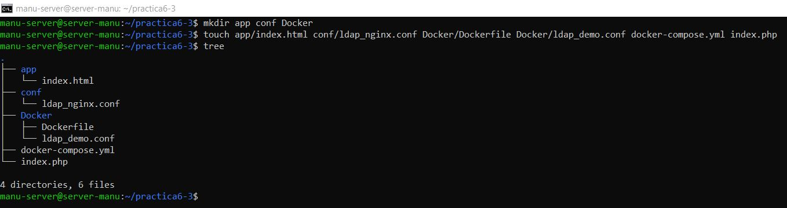

Dentro del archivo `index.html` ubicado en el directorio `app`, se debe agregar un texto de prueba que se mostrará en la página web.

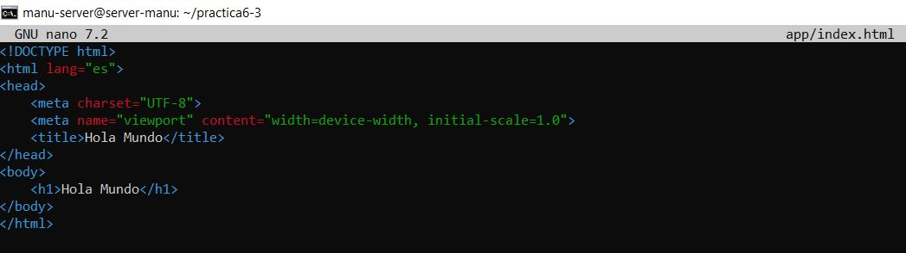

En el archivo `ldap-nginx.conf`, que se encuentra en el directorio `conf`, debemos agregar la siguiente configuración:

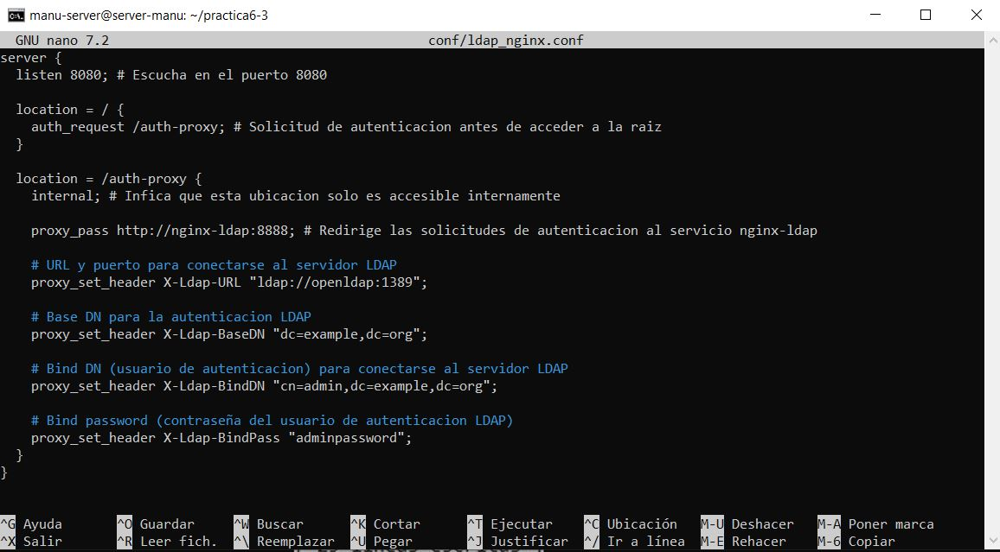

Con esta configuración, Nginx escucha en el puerto 8080 y utiliza la ruta `/auth-proxy` para realizar una autenticación previa. Se redirige la autenticación al servicio en `http://nginx-ldap:8888`. Además, se configuran los encabezados para que Nginx se conecte al servidor LDAP en ``ldap://openldap:1389``, estableciendo el DN base y las credenciales necesarias para las consultas LDAP.

A continuación, creamos el archivo ``docker-compose.yml``, con la configuración adecuada para levantar los contenedores con los servicios `openldap`, `nginx` y `nginx-ldap`.

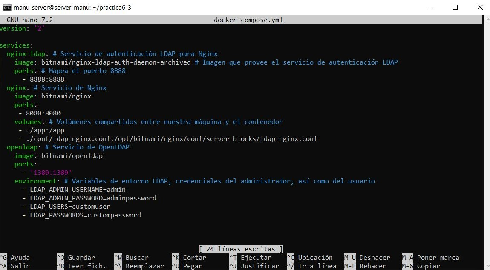

Una vez configurado, ejecutamos el comando `docker compose up -d` para levantar los contenedores en segundo plano.

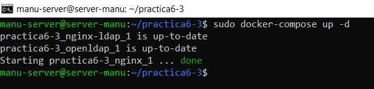

Habilitamos el puerto 8080 que va a ser utilizado por Nginx en la directiva ``proxy_pass``.

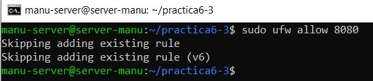

Si accedemos desde nuestra máquina anfitriona a la IP del servidor (`192.168.100.27` en mi caso) con el puerto `8080`, nos saltará la autenticación.

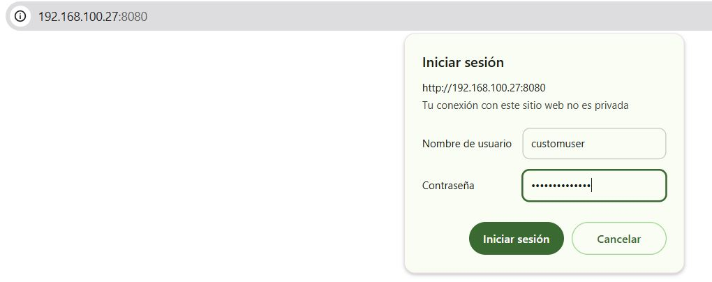

Y si nos autenticamos correctamente usando las credenciales LDAP, podremos acceder a la página web.

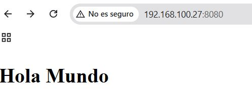

##  Despliegue con Docker de PHP + Apache con autenticación LDAP

Crea un `index.php` con un texto simple para cuando la autenticación por LDAP se haya realizado correctamente.

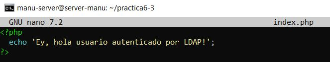

Dentro del directorio `Docker` crea un archivo `Dockerfile`, si aún no lo tienes y añadele el siguiente contenido:

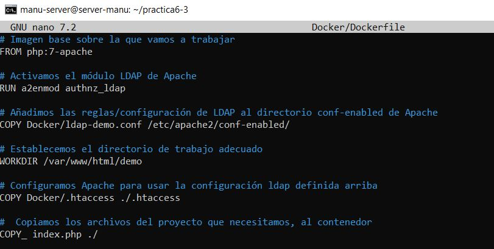

Este archivo construye una imagen Docker que utiliza Apache y PHP, y habilita la autenticación LDAP.

Ahora debemos crear el archivo `ldap-demo.conf`, que contendrá la configuración LDAP, estableciendo los criterios de conexión con el contenedor de OpenLDAP, password y URL de conexión.

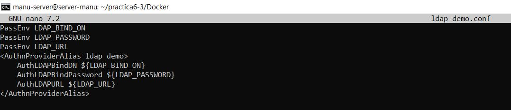

Por último, crea el archivo `.htaccess` que se utilizará para configurar la autenticación básica en Apache y proteger la aplicación web.

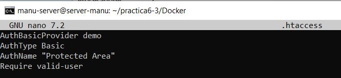

Para construir la imagen Docker, utilizamos el comando `docker build`.

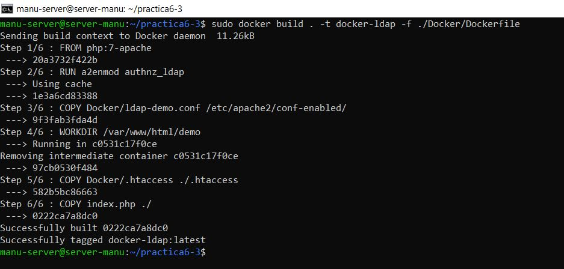

Corre el contenedor en primer plano, indicando las credenciales de nuestra cuenta LDAP mediante variables de entorno con la flag `-e`.

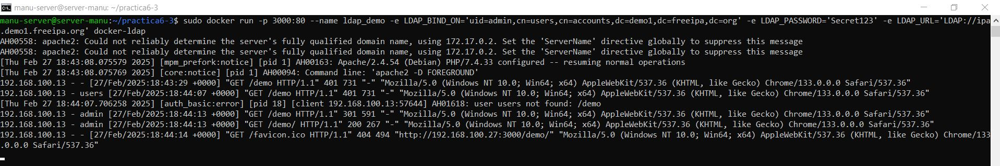

Si accedemos a `http://IP-SERVIDOR:3000/demo` e introducimos en la autenticación el valor pasado en la captura anterior como `uid` y el `LDAP_PASSWORD`, veremos el contenido de nuestro `index.php`.

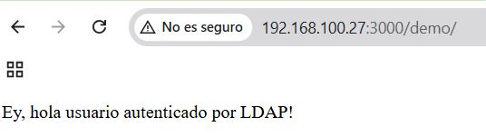